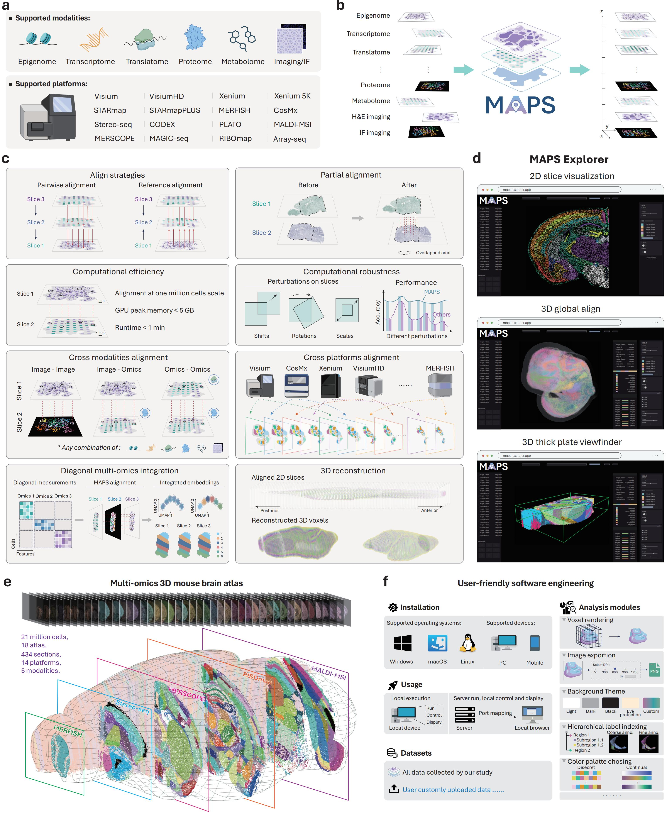

MAPS Documentation
==================

Welcome to the MAPS documentation. This site contains installation notes and tutorial notebooks.

Important Resources
-------------------

.. grid:: 2
    :gutter: 1

    .. grid-item-card:: Installation
        :link: installation
        :link-type: doc

        Install MAPS from GitHub and set up the recommended conda environment.

    .. grid-item-card:: Tutorials
        :link: notebooks/tutorials/index
        :link-type: doc

        Browse the available MAPS tutorial notebooks.

.. toctree::
    :maxdepth: 2
    :hidden:

    installation
    notebooks/tutorials/index
