# 1. Deploy MAPS-Explore
## 1.1 Deploy MAPS-Explore in Windows
### (1) Portable version deployment
For Windows users, please download and unzip this file: [MAPS-Explore-windows-portable.zip](https://zenodo.org/records/22108366/files/MAPS-Explore-windows-portable.zip?download=1). You can use it without installation, but using Chinese paths is not recommended.

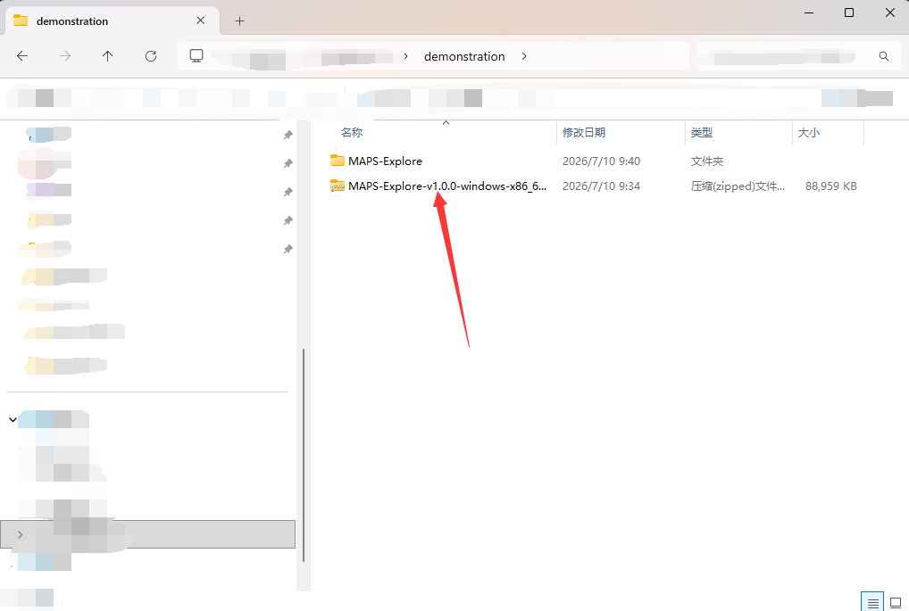

After entering, double-click the left mouse button to start MAPS-Explore

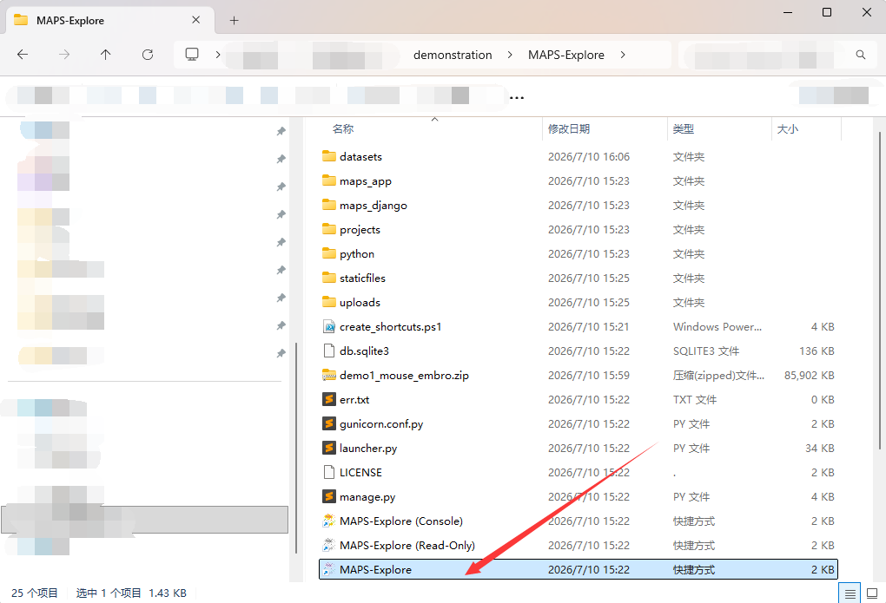

MAPS-Explore will automatically open the browser login front-end interface and maintain a running icon in the system tray

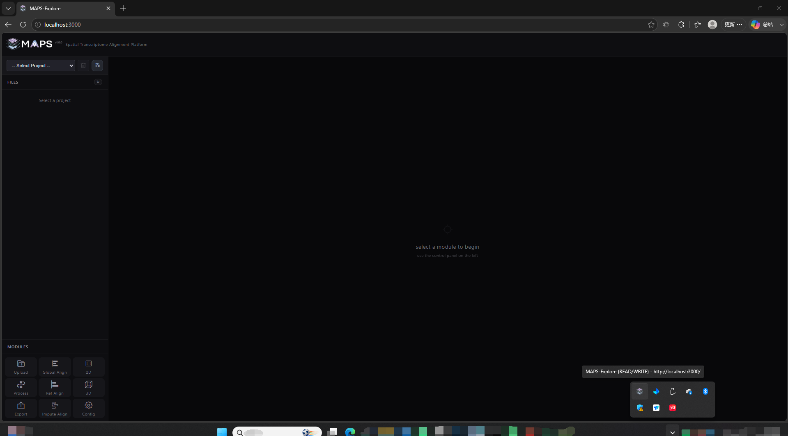

You can switch between edit mode and display mode (read-only mode) by right-clicking on the icon.

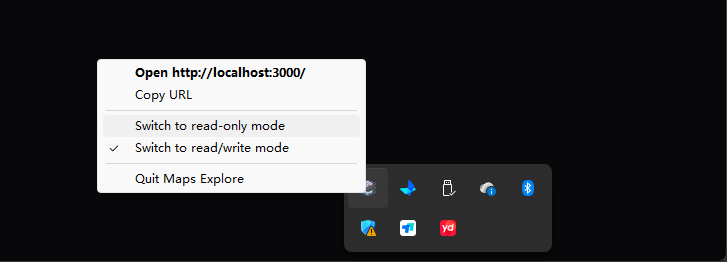

### (2)GitHub installation
If there is a version conflict and you cannot use the portable version directly, we recommend installing the GitHub version. This version does not include a virtual environment that can be used directly, but we provide a convenient installation script. You can use git to pull the project ([https://github.com/frankgene/MAPS-Explore/tree/main](https://github.com/frankgene/MAPS-Explore/tree/main)).

```powershell
git clone https://github.com/frankgene/MAPS-Explore.git
cd MAPS-Explore
.\install.bat
.\start.bat
```

Or directly visit GitHub project package download, unzip and enter the project folder, double-click to run the install.bat script

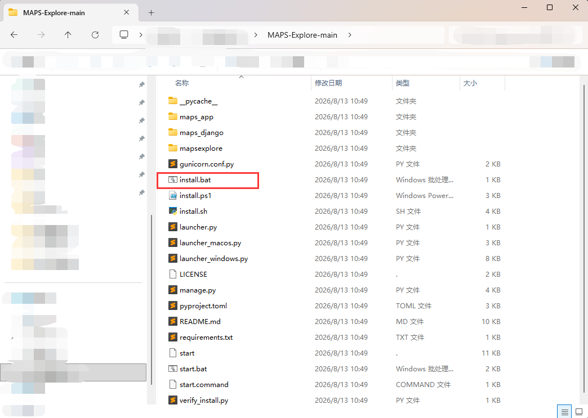

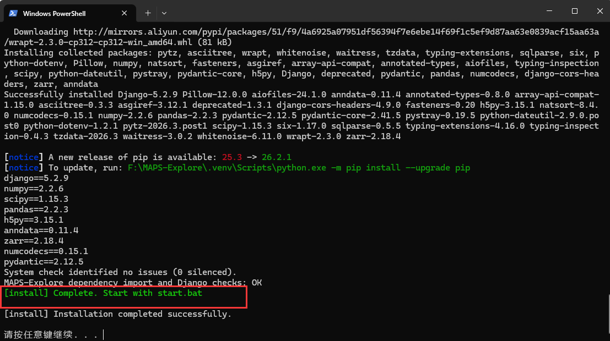

Click any button to close the window, click the start.bat script again to start the service, and switch modes in the system tray

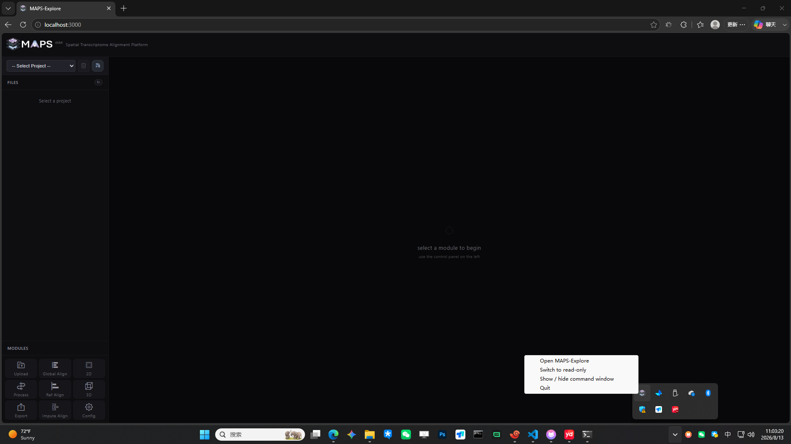

## 1.2 Deploy MAPS-Explore in Linux
### (1) Portable version deployment
For Linux users, please download and unzip this file: [MAPS-Explorer-linux-portable.tar.gz](https://zenodo.org/records/22108366/files/MAPS-Explorer-linux-portable.tar.gz?download=1). We recommend using Ubuntu24+ or CentOS8+ system, and you do not need to pre-configure the environment.

```bash
wget http://bioinfor.imu.edu.cn/biocloud/downloads/MAPS-Explore-v1.0.0-linux-x86_64-portable.tar.gz
tar -xzf MAPS-Explore-v1.0.0-linux-x86_64-portable.tar.gz
cd maps-explore
bash start
```

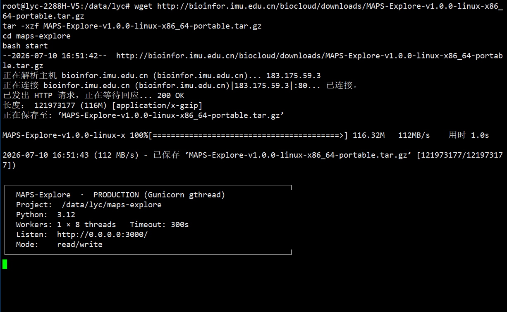

At this point you need to view the front panel through a visual operating system that has access to the corresponding Linux device. This can be the Linux system itself (if you have a graphical interface), or it can be any remote device with a graphical browser. When accessing, you need to pay attention to whether port 3000 is blocked by the firewall. If you need to deploy or port forward within the container, please pay attention to port mapping.

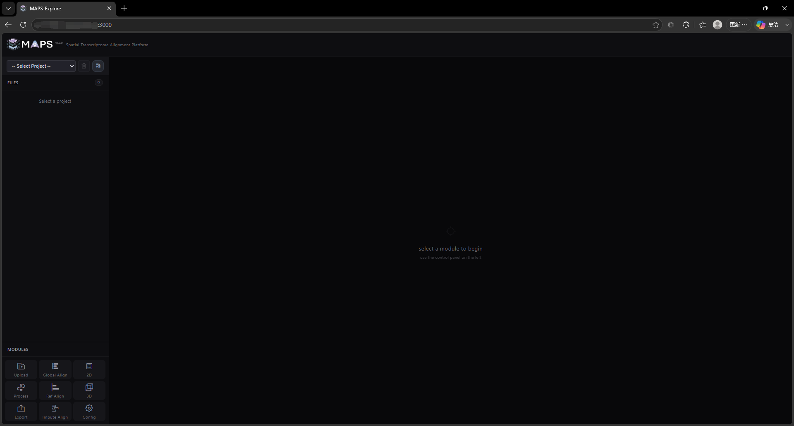

Additionally, you can initiate presentation mode (read-only) via

```bash
bash start --read-only
```

### (2)GitHub installation
If there is a version conflict and you cannot use the portable version directly, we recommend installing the GitHub version. This version does not include a virtual environment that can be used directly, but we provide a convenient installation script. You can use git to pull the project and install and run.

```bash
git clone https://github.com/frankgene/MAPS-Explore.git
cd MAPS-Explore
./install.sh
./start.sh
```

## 1.3 Deploy MAPS-Explore on macOS
### (1) Portable version deployment
For macOS users, please download and unzip this file: [MAPS-Explore-macos-portable.zip](https://zenodo.org/records/22108366/files/MAPS-Explore-macos-portable.zip?download=1).

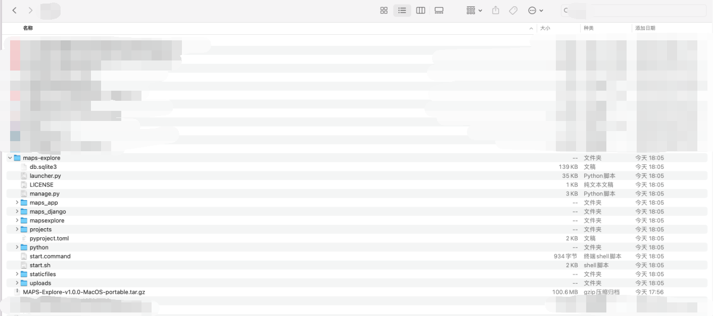

Next, please open the terminal and enter the decompressed folder, execute the startup command, the logic is the same as the Linux system startup, but we have made visual adaptation to the macOS system environment and Safari browser

```bash
cd Downloads/maps-explore
ls
bash start.sh
```

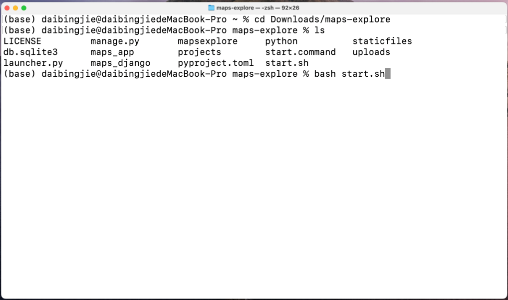

MAPS-Explore can automatically open the default browser and display the icon in the top bar in the upper right corner. Right-click to switch modes.

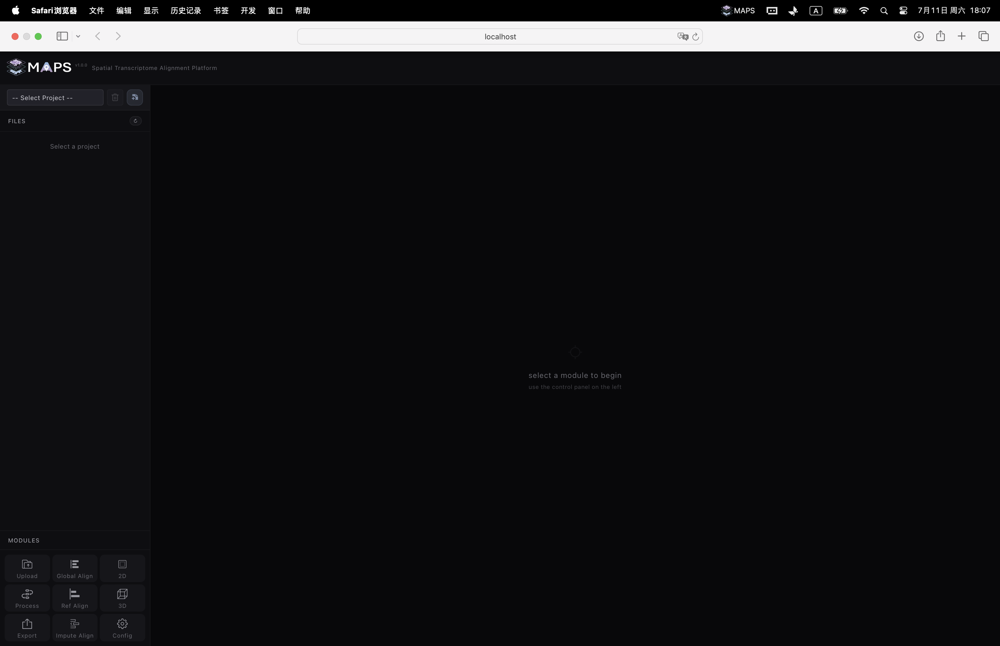

### (2)GitHub installation
If there is a version conflict and you cannot use the portable version directly, we recommend installing the GitHub version. This version does not include a virtual environment that can be used directly, but we provide a convenient installation script. You can use git to pull the project and install and run.

```bash
git clone https://github.com/frankgene/MAPS-Explore.git
cd MAPS-Explore
./install.sh
./start.sh
```

## 1.4 MAPS-Explore operating mode selection
MAPS-Explore includes two modes. No matter which mode, the service is opened on port 3000 of the current device by default:

+ **Edit mode:** Supports all functions, including creating and destroying projects, uploading or downloading slice data, running alignment tasks, and project parameter configuration
+ **Display mode:** Only supports project loading, 2D/3D visualization, does not support any data writing operations, suitable for demonstration and sharing results

## 1.5 Precautions for using MAPS-Explore
+ We recommend that you deploy MAPS-Explore in a location with sufficient storage space when deploying large-scale 3D visualization tasks, because smooth loading of the front-end requires the back-end to pre-generate block data and dense matrices, which will occupy storage space
+ We recommend adjusting the parallel thread parameters according to your own device (refer to 2.10 Configuration Interface Demonstration). The default setting of 8 parallel threads may not work properly in some devices.
+ We strongly recommend that you do not use Chinese and path names containing symbols to deploy or create projects. In some cases, the path may not be recognized.
+ You are only allowed to upload H5AD files, and try to ensure that a single file corresponds to a single slice. In addition, although we have done acceleration processing such as chunking and parallelization on the front end, large-scale data upload may cause efficiency bottlenecks. At this time, we recommend that you look for the projects directory in the deployment location of MAPS-Explore, where you can see the created projects and enter the upload folder of the specified project. You can copy or migrate your data here.
+ 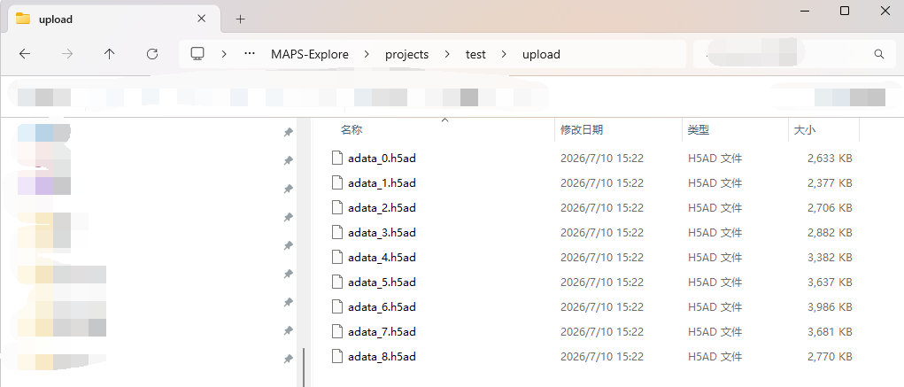

