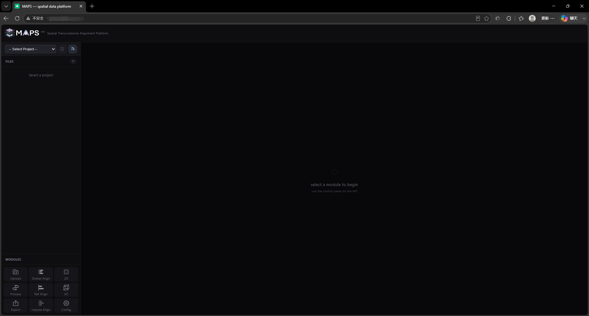

# 2. Front-End Feature Walkthrough

## 2.1 Open MAPS-Explore
If you have MAPS-Explore installed locally and have a graphical operation interface and any browser locally, please open the browser and enter the following URL:

```bash
http://127.0.0.1:3000/
```

If you have deployed MAPS-Explore on a remote server, please configure the corresponding firewall open port list and use the following URL:

```bash
http://your_ip:3000/
```

Note that if you deploy MAPS-Explore in a Docker container or your MAPS-Explore project needs to be accessed from the external network, you may have to achieve access through port forwarding. In this case, you should use the IP and corresponding port of the intermediate server.



