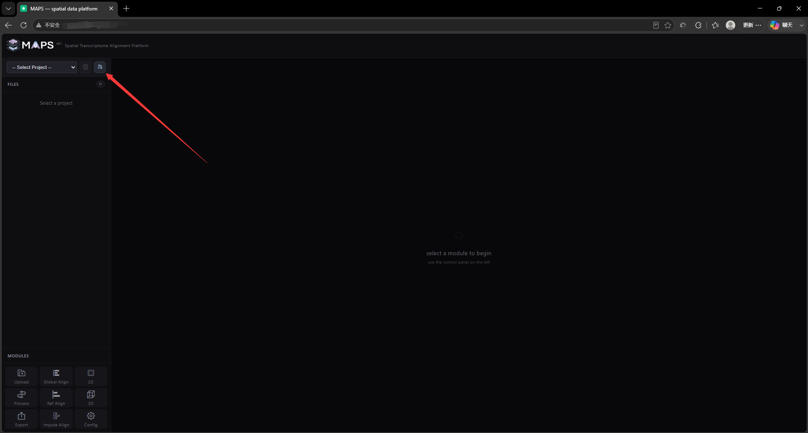
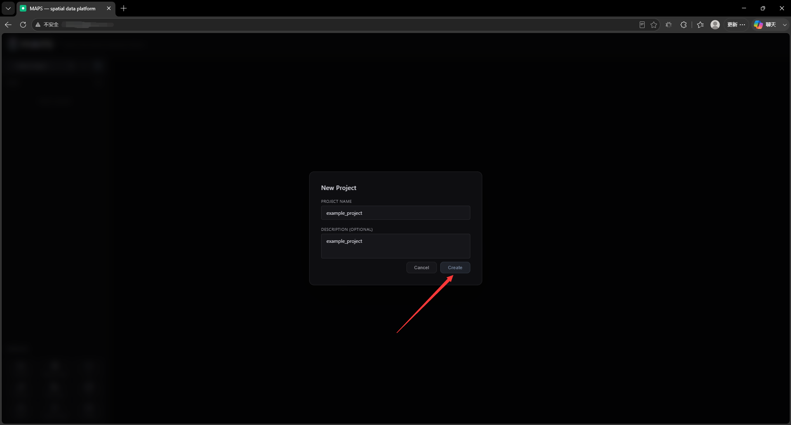
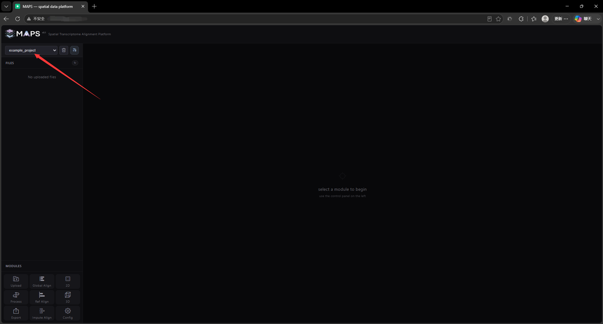

# 2. Front-End Feature Walkthrough

## 2.2 New project
Click the Create Project icon in the upper left corner

Fill in the project name and description in the pop-up window (optional). Note that the project name must be in English and cannot have spaces or special symbols, otherwise the project will not be loaded correctly!

When the project name appears in the project tab on the right, it is successfully created.

