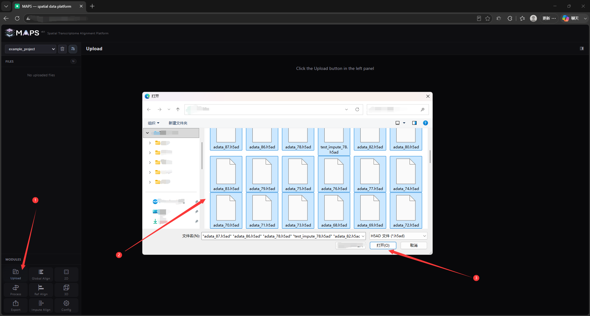
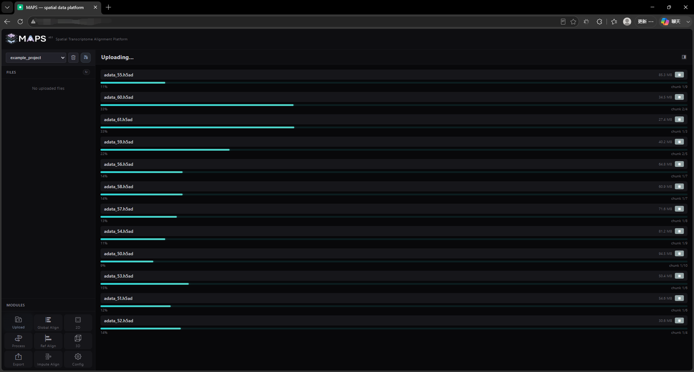
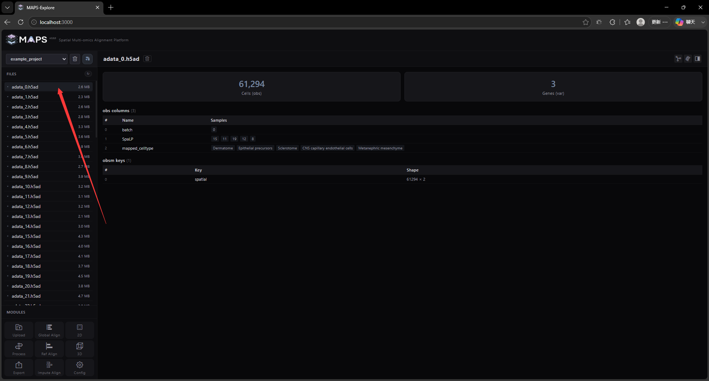

# 2. Front-End Feature Walkthrough

## 2.3 Upload data
Currently, MAPS-Explore only supports H5AD format data upload. To ensure that your data can be recognized and loaded normally, we recommend using AnnData 0.12.11 to process and save slice files. We have not tested all other versions. Select and upload data by clicking the Upload button in the lower left corner (download address: [MAPS-example-full.zip](https://drive.google.com/file/d/1KsbesaQBtDAyKmjK7fNaeLfjwLBbRVWe/view?usp=drive_link)):

The selected H5AD files will be uploaded to the backend in batches, and the upload speed depends on the bandwidth:

After the upload is completed, you can see the file in the file tree on the left. Click on the file to preview part of the file information. Note that MAPS-Explore only displays the number of cells, number of genes, obs information, obsm information and uns information, and only intercepts part of the data for display. We do not recommend that you keep too much information in the H5AD file, as this will slow down the upload and loading speed. The data information preview effect is as follows:

