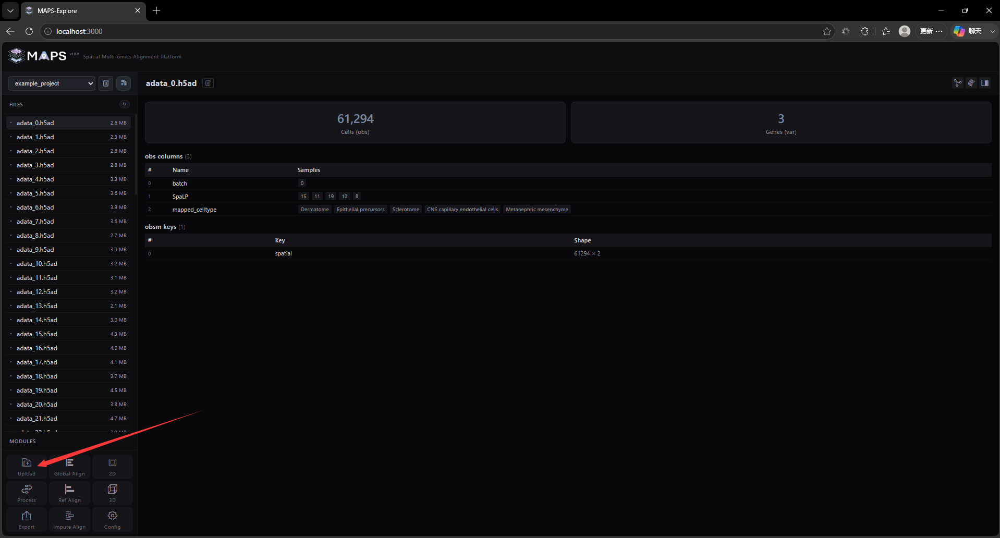
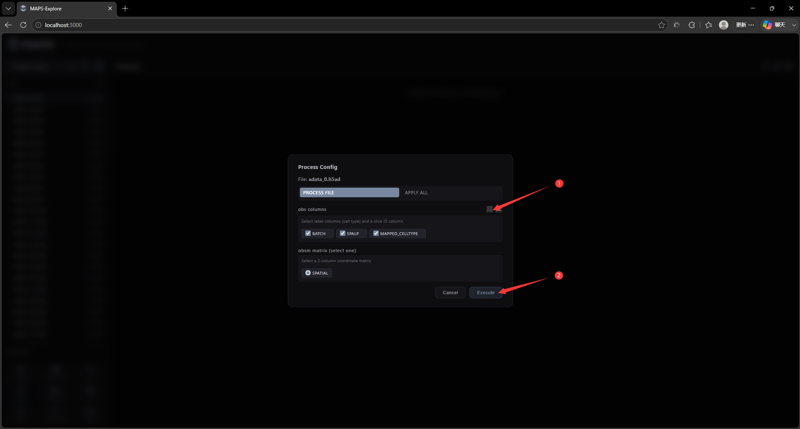
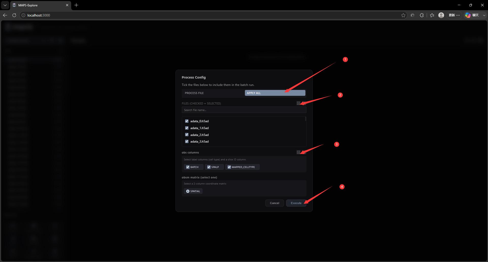
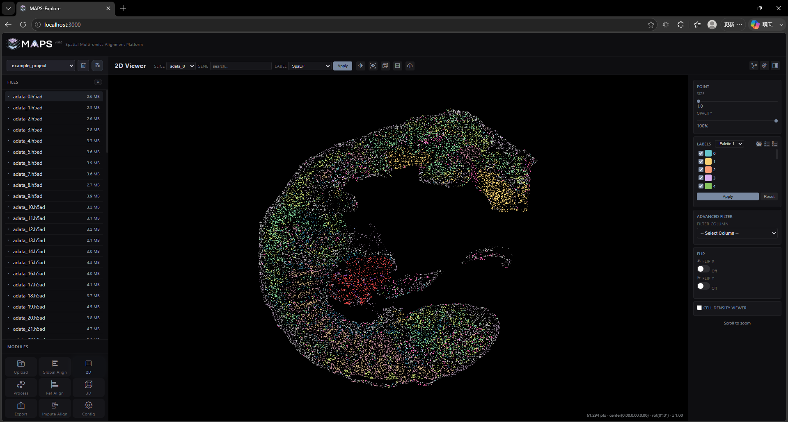

# 2. Front-End Feature Walkthrough

## 2.4 Data processing
The purpose of this step is to improve the efficiency of 2D and 3D visualization. We use a variety of data acceleration methods and need to convert your H5AD files into compressed binary files to ensure smooth loading of visualizations and low memory burden. You first need to click on a file to view its information, then click the Process button in the lower left corner, select the obs label that needs to be saved in the pop-up window, and specify the slice coordinate label (usually in obsm).

We also provide multi-slice processing function, you can process all slices uniformly:

Click the Execute button to start the Process. The processing may take a while, depending on the slice size and multi-threading settings you provide (which can be set in the Config interface). After the process ends, it will jump to the 2D visualization interface:

