# 2. Front-End Feature Walkthrough

## 2.5 2D Visualization
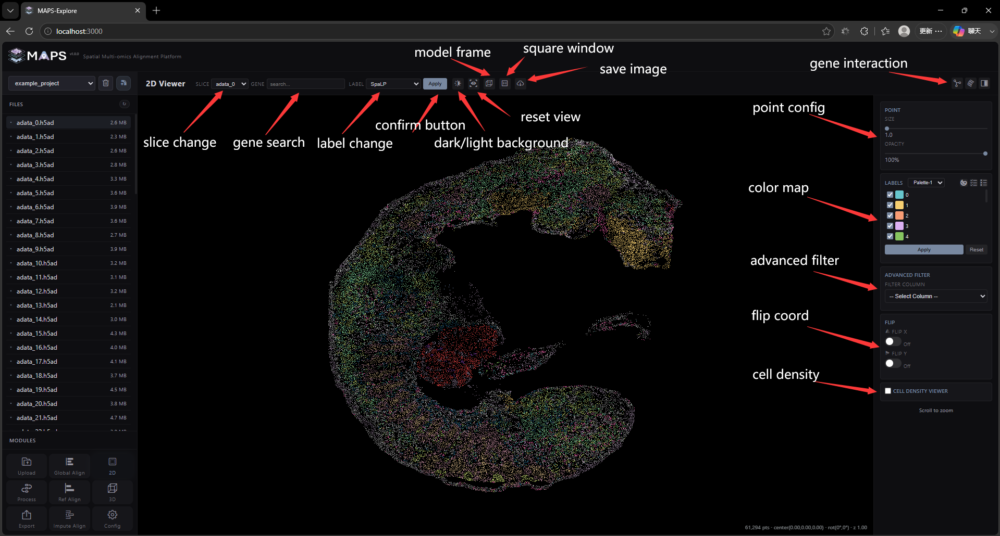

The 2D visualization interface contains multiple visualization functions, for the top navigation bar:

### (1) SLICE drop-down menu
+ SLICE drop-down menu: used to switch slice files
+ 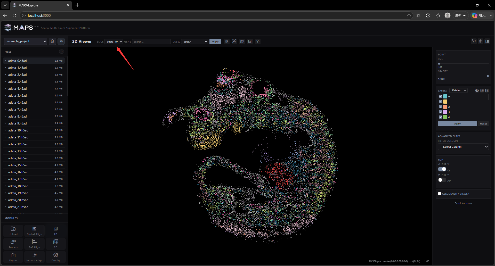

### (2) GENE input box
+ GENE input box: used to search the gene list, click the Apply button to refresh, data loading will take a certain amount of time, depending on the data size
+ 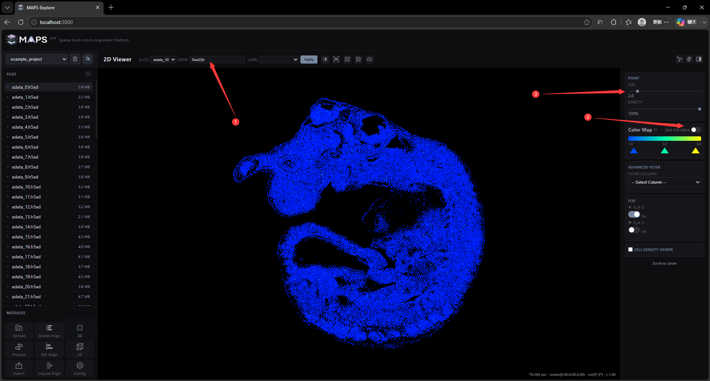

### (3) LABEL drop-down menu
+ LABEL drop-down menu: used to switch cell labels. Click the Apply button to refresh. Data loading will take a certain amount of time, depending on the size of the data.
+ 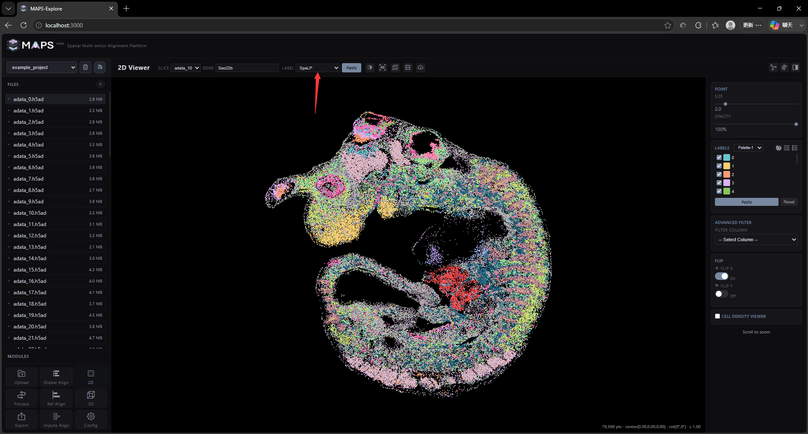

### (4) dark/light button
+ dark/light button: used to switch the background color. The black background is loaded by default and can be set in the Config interface.
+ 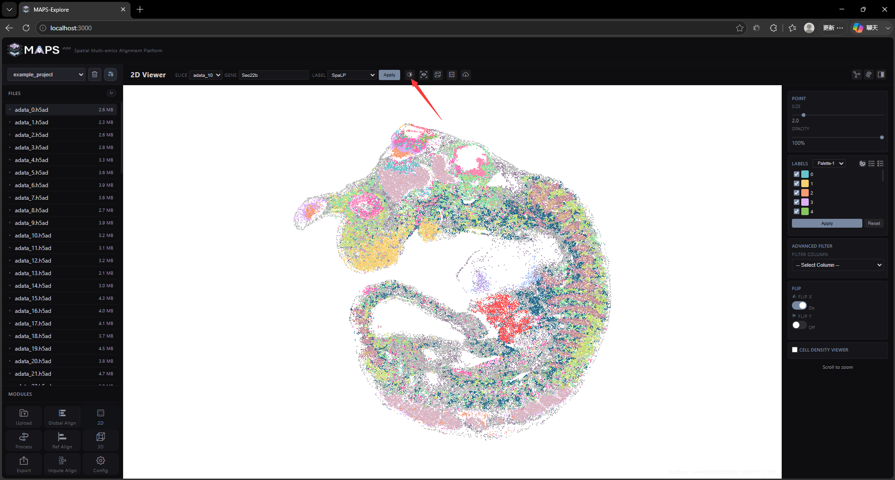

### (5) reset button
+ reset button: used to reset the view. The user can drag the slice with the right mouse button, or zoom in and out with the mouse wheel. This button can restore the initial view and zoom ratio.

### (6) Model Frame button
+ Model Frame button: used to add borders and scales, and can indicate the physical dimensions of the slice
+ 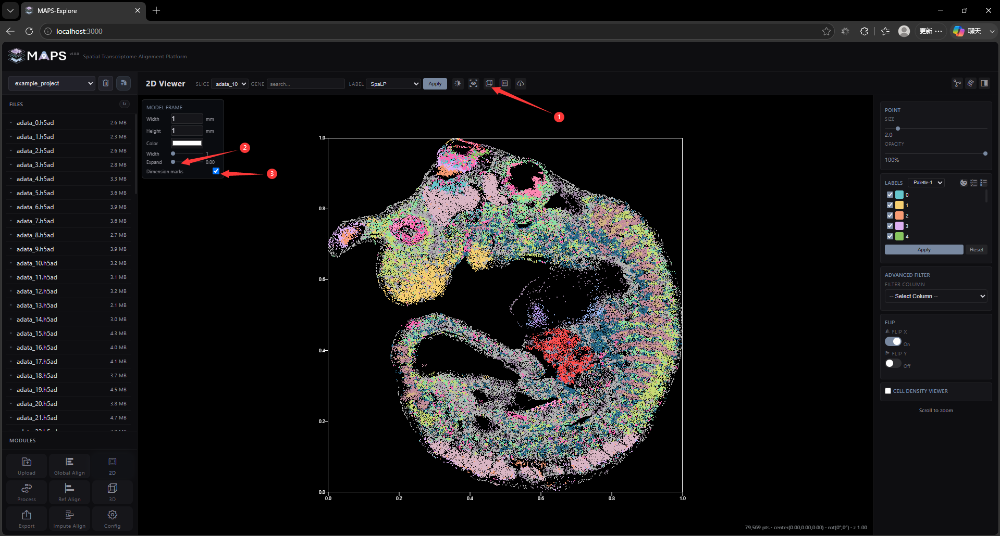

### (7) Window shape button
+ Window shape button: used to switch the window shape, the default is rectangular, click to switch to square, click again to restore the rectangular window
+ 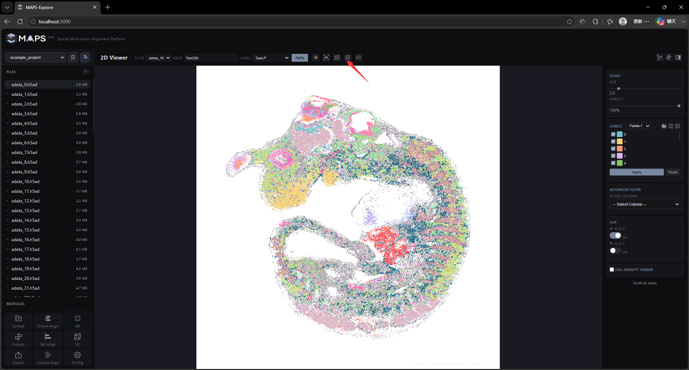

### (8) Save figure button
+ Save figure button: Click to save the current window to a PNG image. The resolution is affected by the screen size and magnification (HD parameters can be set in the Config interface, the default is 2X)
+ 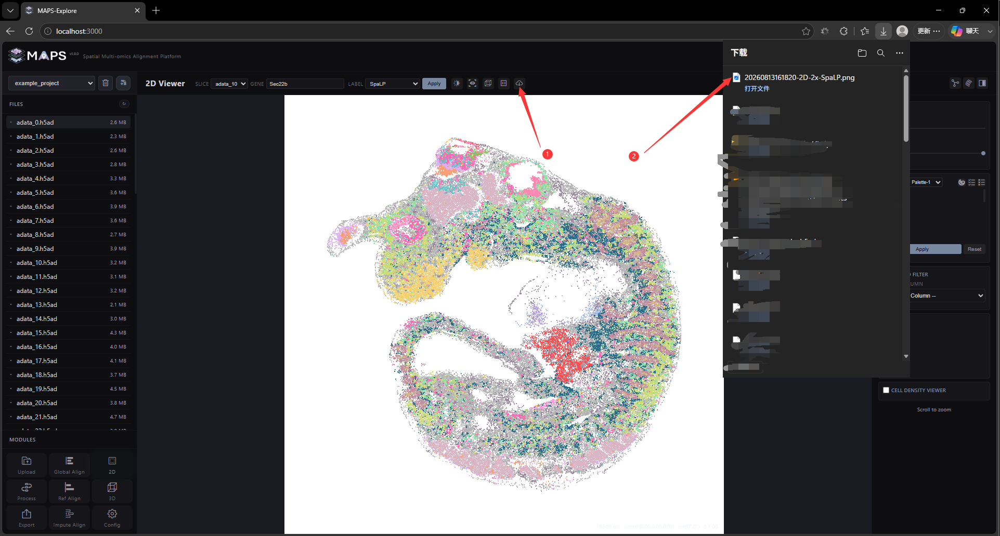

For the right sidebar:

### (9) POINT Card
+ POINT Card: can change the size and transparency of points
+ 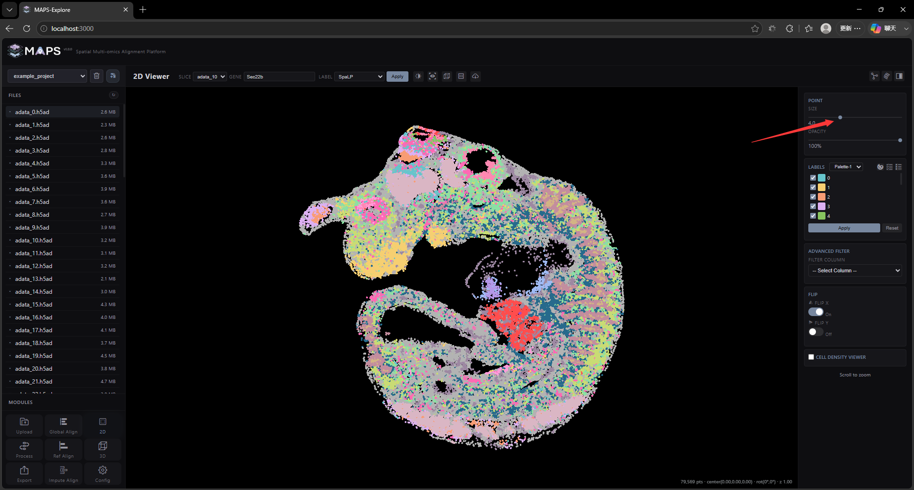

### (10) LABELS Card
+ LABELS Card: used to set color mapping (only for categorical labels, invalid for numerical labels such as gene expression values). The drop-down menu on the right side of the title can switch color palettes (we provide 5 sets of color palettes, which can be set in the Config interface). The three buttons on the right are used for "Export Palette", "Select All" and "Deselect All", which are shortcut operations for the multi-select box below. The multi-select box on the left side of the color entry below can be used to control whether the points of the corresponding label are displayed. Clicking the color rectangle can also switch the mapping color. The Apply button below needs to be clicked to confirm after modifying the color to refresh the color mapping. The Reset button is used to restore the default color mapping.
+ 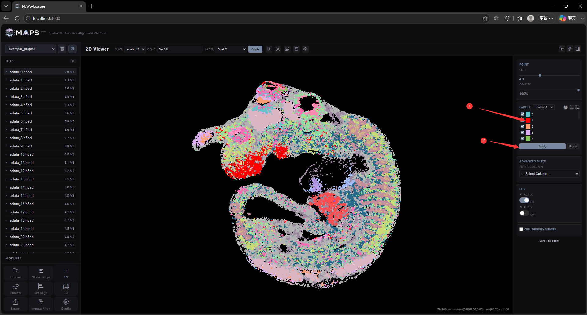
+ 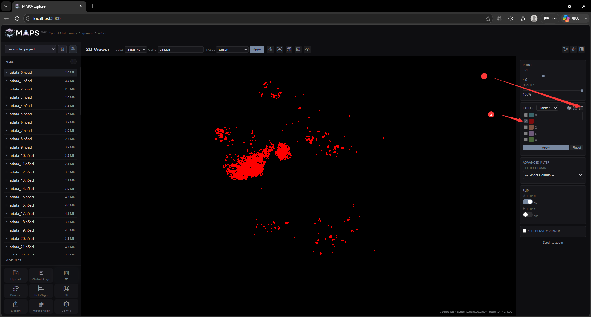

### (11) ADVANCED FILTER Card
+ ADVANCED FILTER Card: For hierarchical label filtering, you can select another label (perhaps a more dominant cell type or region) from the drop-down menu, thereby displaying only the cell types in that region
+ 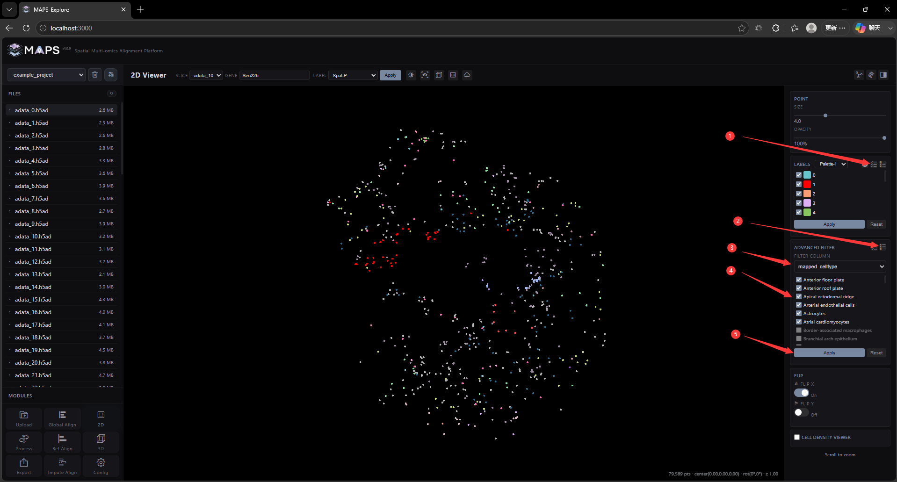

### (12) FLIP Card
+ FLIP Card: used to mirror the X- and Y-axis coordinates
+ 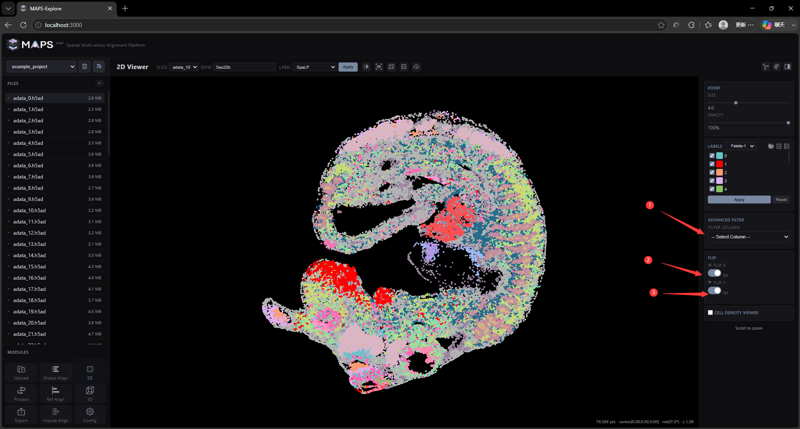

### (13) CELL DENSITY VIEWER
+ CELL DENSITY VIEWER: for visualizing cell density
+ 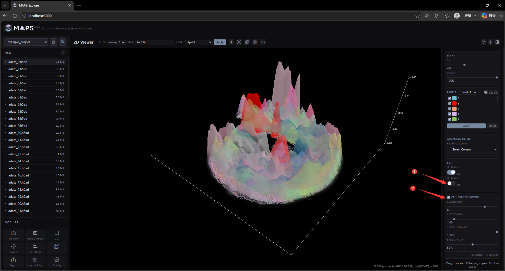

