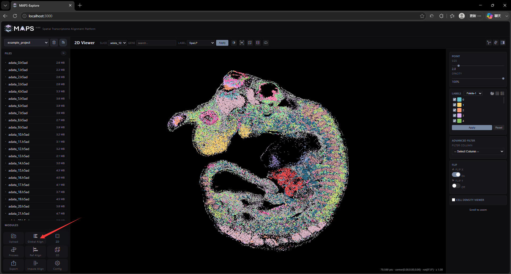
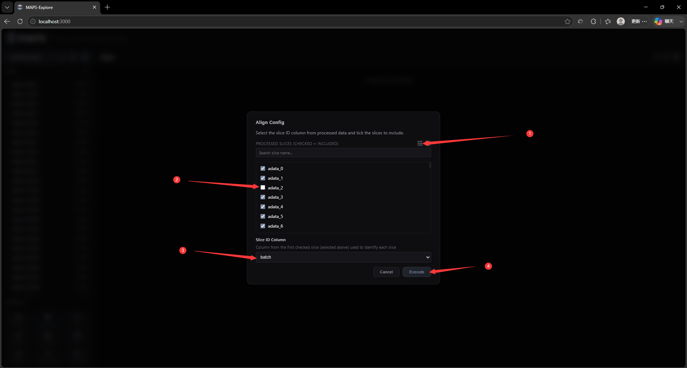
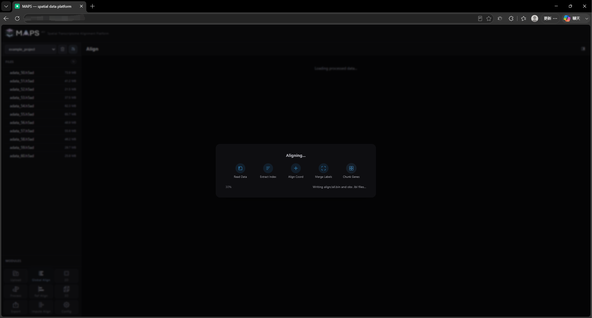
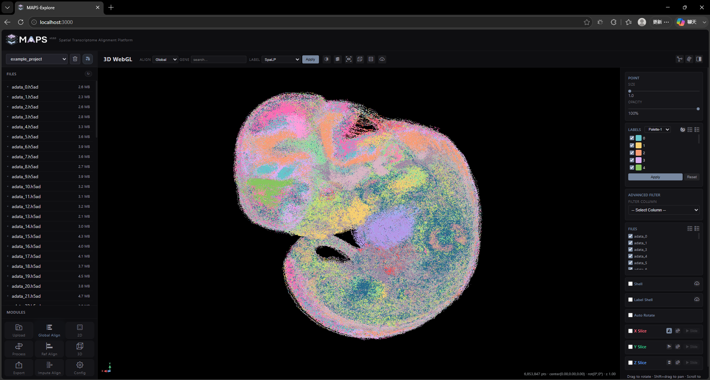

# 2. Front-End Feature Walkthrough

## 2.6 Global slice alignment
You can initiate a global slice alignment task by clicking the Global Align button in the lower left corner, and specify the slices and order involved in the alignment in the pop-up window:

Note that I exclude adata_2 here to demonstrate the subsequent insertion alignment task. I specified the batch tag as the slicing order. The real slicing order must be selected and the batch column elements should be of numeric type:

The project may take some time to run because it involves data integration and coordinate alignment calculations:

When the task processing is completed, the 3D visualization interface will automatically open:

