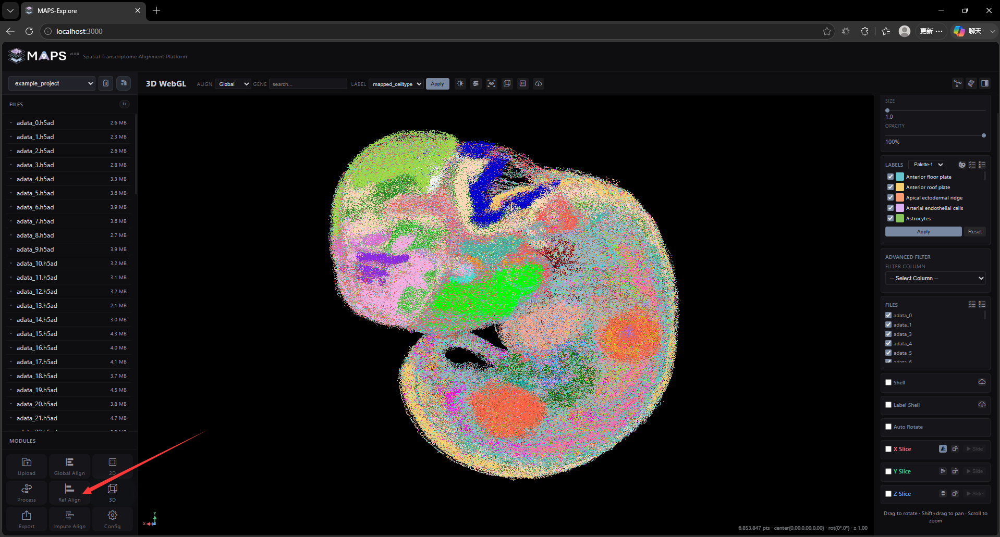
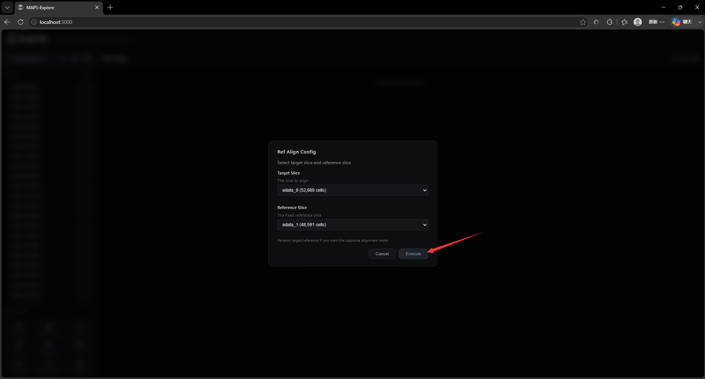
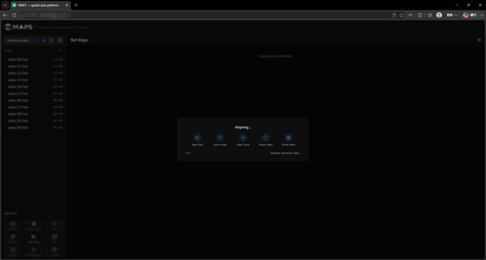
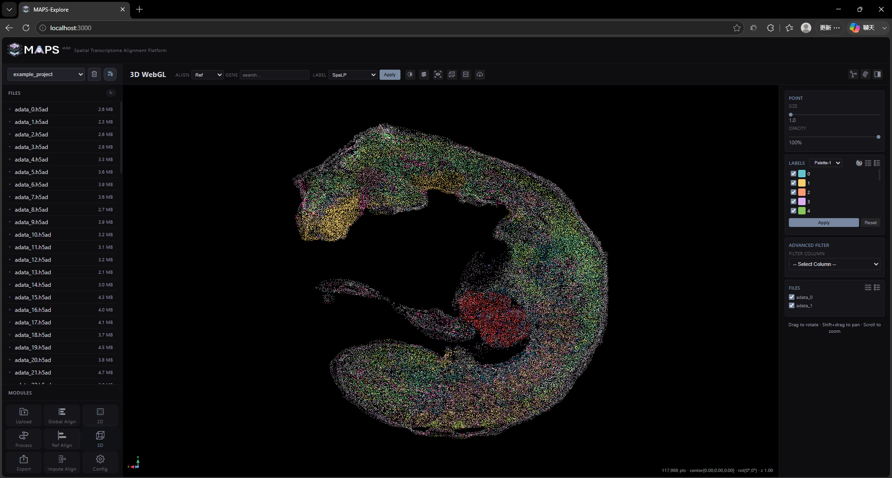

# 2. Front-End Feature Walkthrough

## 2.8 Reference slice alignment
Unlike Global Align, this mode aligns two specified slices within the same plane. Click Ref Align in the lower-left corner, then select the two slices in the dialog box:

The alignment may take some time to complete:

When processing is complete, MAPS-Explore opens a 3D visualization window with a reduced feature set:

Only the two selected slices are available in this view. Voxelization, rotation, slab slicing, and related features are disabled.
