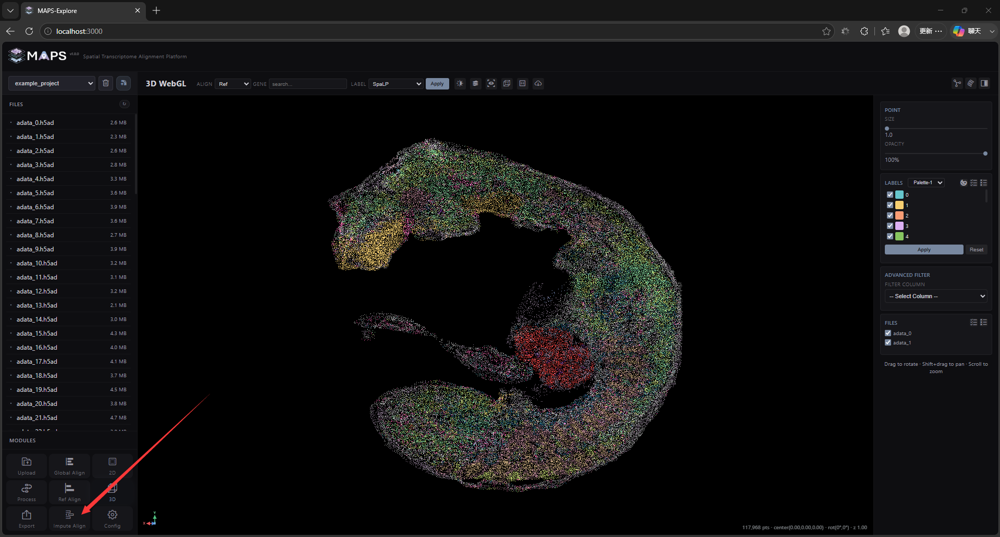
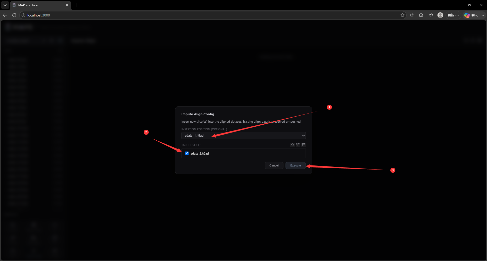
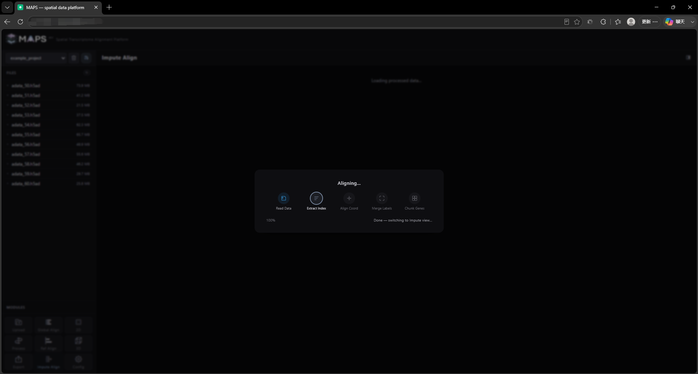
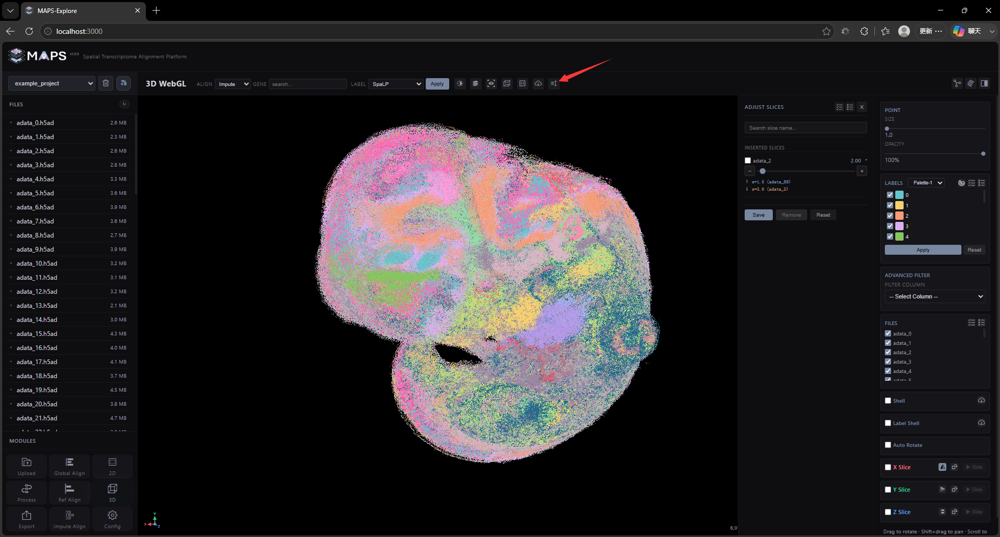

# 2. Front-End Feature Walkthrough

## 2.9 Insert slice alignment
This mode integrates one or more slices excluded from Global Align into an existing aligned reference atlas. Click Impute Align in the lower-left corner, then select the slices and their insertion positions in the dialog box:

Several insertion-position methods are available. Auto-match position identifies the most similar reference slice and places the new slice next to it at the target slice's Z coordinate plus 0.5. UNS_atlas_match-First reads the selected slice's `uns` metadata and obtains the target slice from `atlas_match.best_atlas_slice_idx`; populate this field to define insertion positions in batches. Auto-match position also writes its result to this field. For a single slice, you may specify the target directly; the same Z-axis offset of +0.5 is applied:

Processing time depends on slice size and the multithreading threshold configured in Config.

When insertion is complete, MAPS-Explore opens the 3D visualization interface. Click the adjustment button in the top toolbar to open the list of inserted slices.

From this list, you can search for slices, adjust and save their positions, or delete multiple inserted slices at once.
