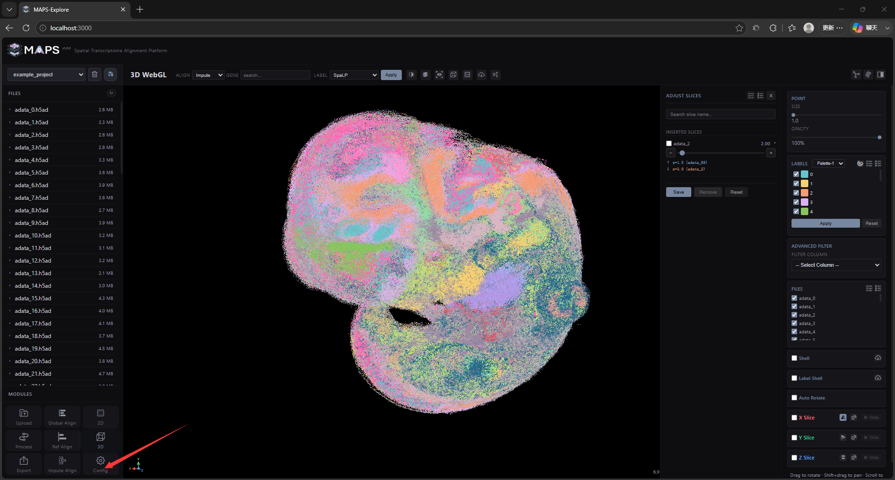
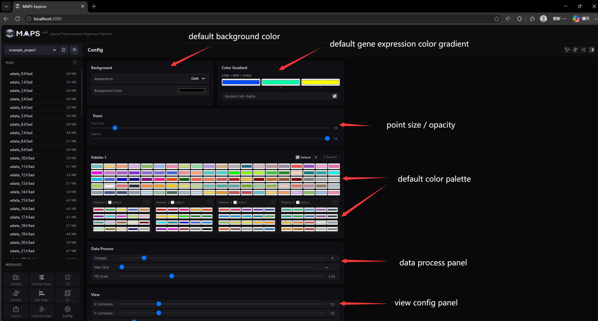
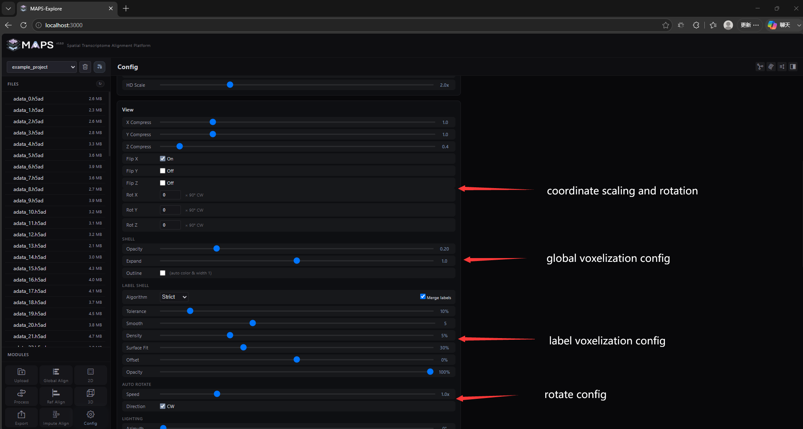
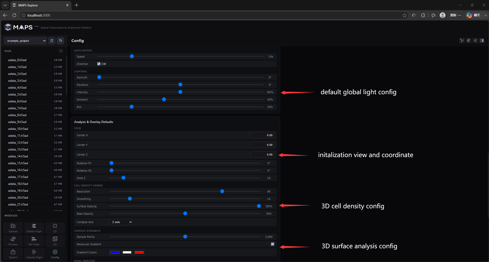
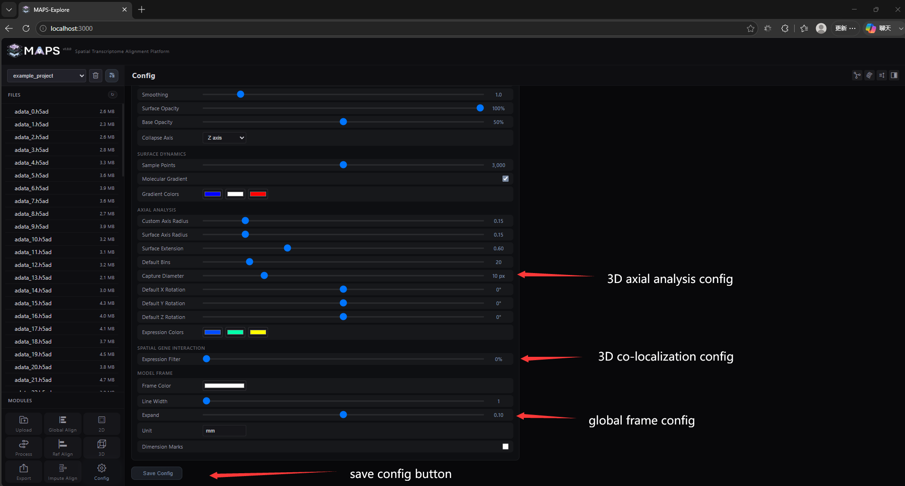
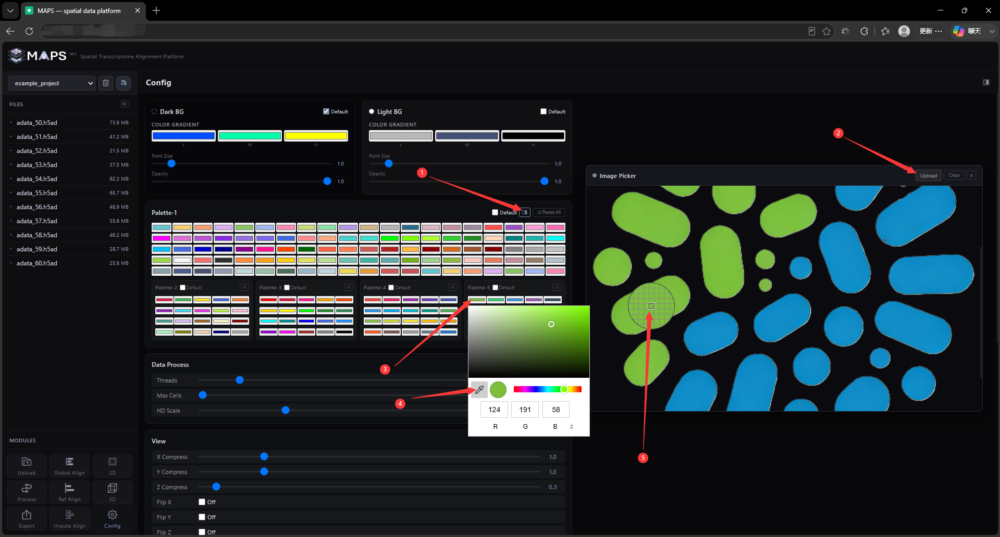

# 2. Front-End Feature Walkthrough

## 2.10 Configuration interface
You can click the Config button in the lower left corner to enter the configuration interface

The configuration interface defines the project's default loading parameters. Each project has its own configuration file. After modifying the settings, click Save to persist the custom parameter values. The available panels are described below:

+ Background panel: sets the default background color for the 2D and 3D visualization windows.
+ Color Gradient panel: sets the default gene expression color for the 2D and 3D visualization windows.
+ Palette panel: configures the preset color palettes. Five palettes are provided: Palette-1 contains 100 preset colors, while Palette-2 through Palette-5 each contain 20. Palette-1 is used by default. If a categorical label contains more than 100 categories, the application cycles through the palette with an offset to reduce repeated colors. Click the sidebar button next to Palette-1 to open an image picker; you can then upload a color image and use the eyedropper tool to configure colors efficiently.
+ 
+ Data Process panel: Threads controls the number of concurrent threads used by Process. Max Cells controls visualization downsampling to reduce front-end rendering load, which is particularly useful on lower-performance client devices. HD Scale controls the image-export scale factor; the exported resolution equals the screen resolution multiplied by this factor. On a 1080p display, the default 2× scale generally produces high-quality output. Because of limitations in the visualization architecture, vector output formats such as SVG and PDF are not available.
+ View panel: contains presets for multiple visualization parameters. XYZ Compress controls axis scaling; the Z axis defaults to 0.3 to produce a more compact stack of slices. Flip XYZ controls coordinate mirroring and is disabled by default. Rot XYZ controls coordinate rotation and defaults to 0. The SHELL settings control opacity, expansion distance, and outline rendering for the global voxelized shell. LABELS SHELL provides three parameters: Tolerance selects the leading n% of points for computation when a label contains multiple disconnected clusters; Smooth sets the number of Gaussian-smoothing iterations—higher values produce smoother but larger surfaces and may prevent the shell from closing; and Density removes low-density points to ensure smooth rendering of the principal cluster. AUTO ROTATE controls automatic rotation speed and direction. LIGHTING controls shell illumination through Azimuth (horizontal light angle), Elevation (vertical light angle), Intensity (light intensity), Ambient (ambient-light intensity), and Rim (shell reflectivity).
+ Analysis & Overlay Defaults panel: Used to specify the default parameters of the 3D native analysis module.
