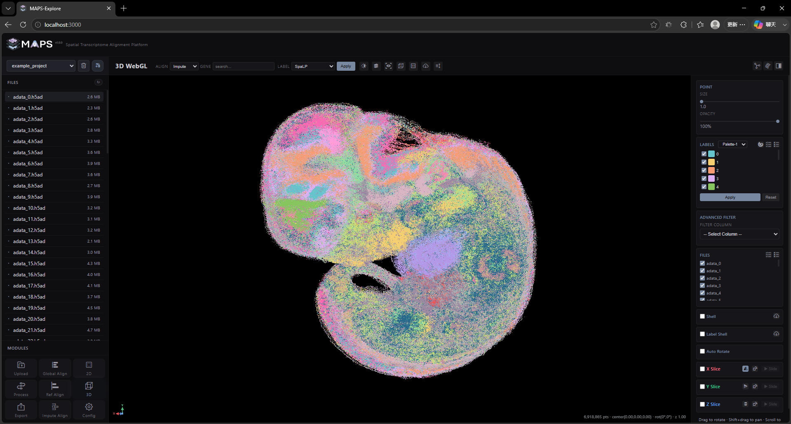
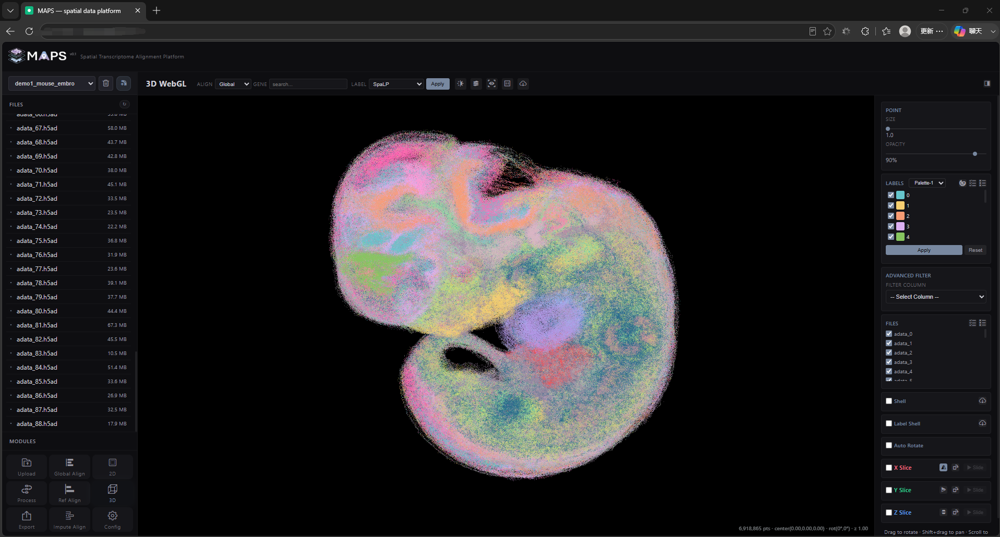
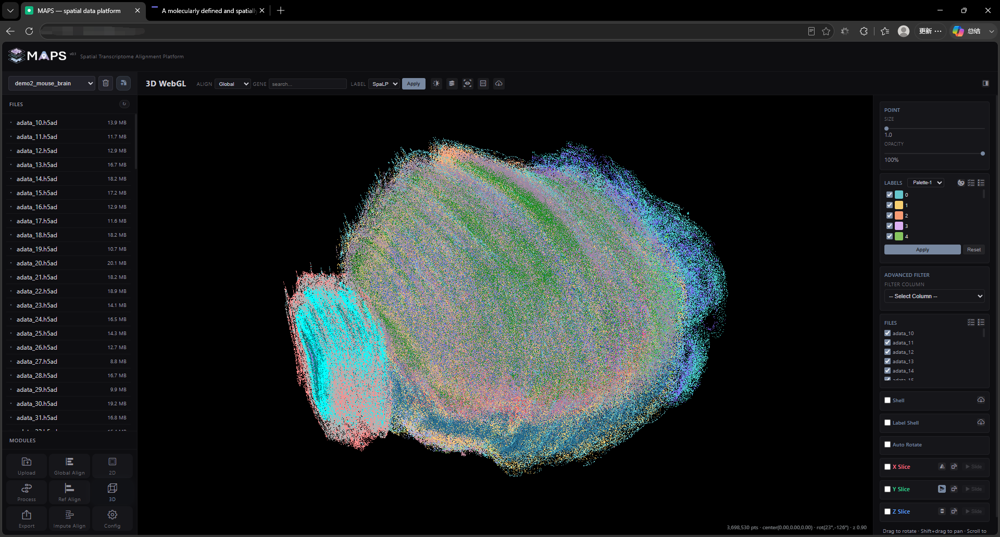
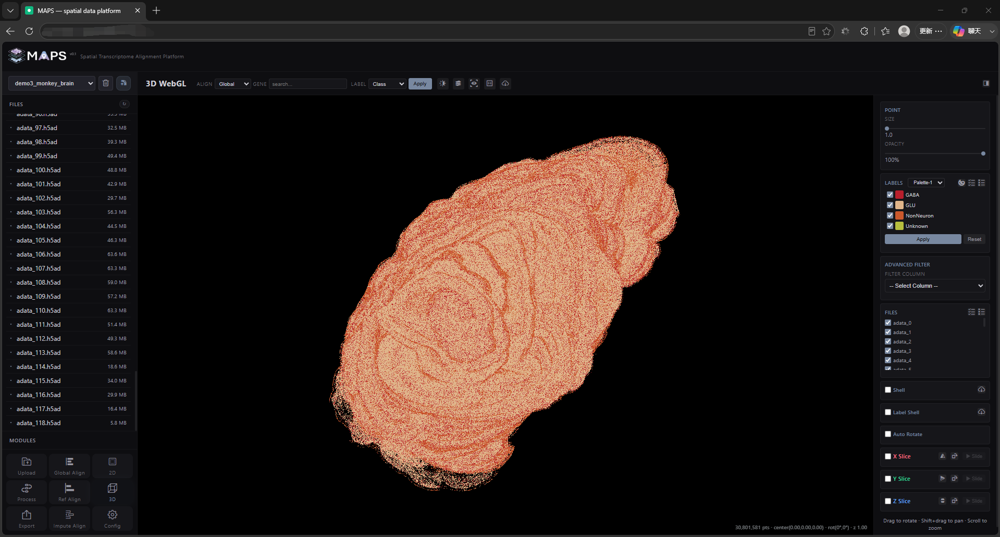
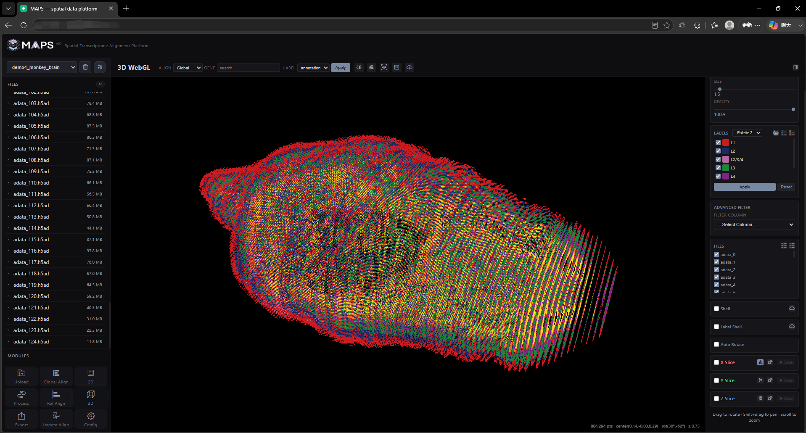
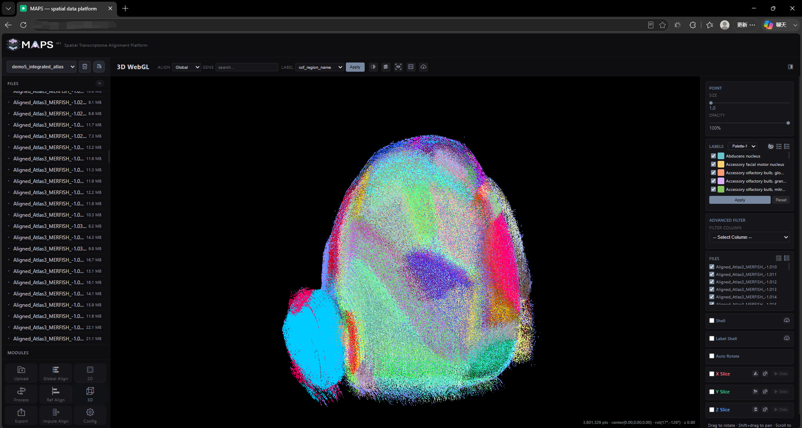
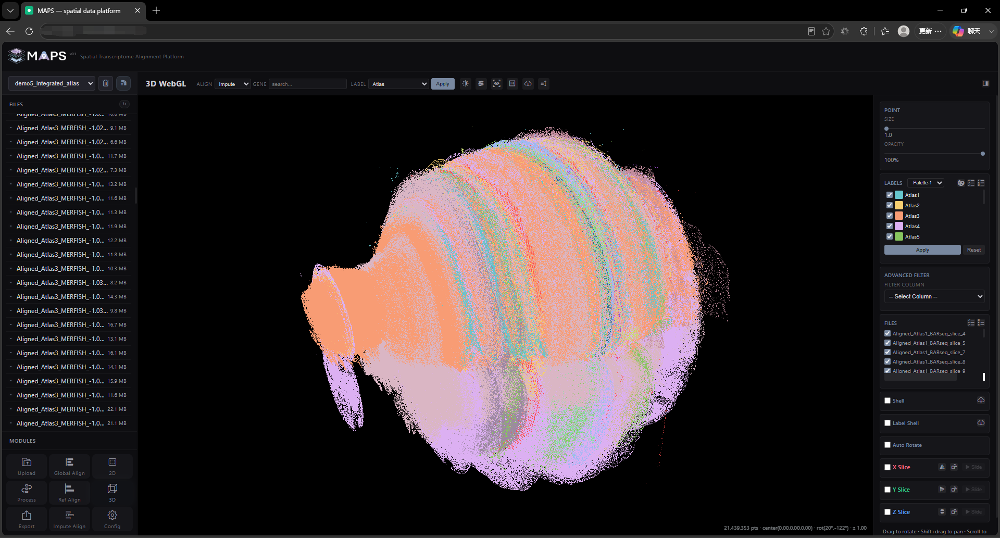

# 3. Demo Data
Six preprocessed demo datasets are available at [http://www.bioinfor.tech/maps/](http://www.bioinfor.tech/maps/). Two nonredundant test datasets are also available for hands-on use: [MAPS-example.zip](https://drive.google.com/file/d/1xrS71mh_tn8CpBYVwZjm2x51R2atUDDF/view?usp=drive_link) and [MAPS-example-full.zip](https://drive.google.com/file/d/1KsbesaQBtDAyKmjK7fNaeLfjwLBbRVWe/view?usp=drive_link).

## 3.1 example_project
This tutorial dataset contains a small number of slices and therefore loads quickly. It contains 6,918,865 cells, with an estimated loading time of approximately 3 seconds for the Global Align 3D visualization:

## 3.2 demo1_mouse_embro
This dataset comprises spatial transcriptomic measurements from an E11.5 whole mouse embryo and was obtained from [Spateo](https://www.cell.com/cell/fulltext/S0092-8674(24)01159-0) (DOI: 10.1016/j.cell.2024.10.011). It contains 89 slices and 6,918,865 cells. The estimated loading time for the Global Align 3D visualization is approximately 20 seconds:

## 3.3 demo2_mouse_brain
This mouse hemibrain spatial transcriptomics dataset was generated using [MERFISH](https://cellxgene.cziscience.com/collections/0cca8620-8dee-45d0-aef5-23f032a5cf09) (DOI: 10.1038/s41586-023-06808-9). It contains 129 coronal sections and 3,698,530 cells. The estimated loading time for the Global Align 3D visualization is approximately 10 seconds:

## 3.4 demo3_monkey_brain
This whole-cortex spatial transcriptomics dataset from the marmoset brain was generated using [Stereo-seq](https://www.cell.com/cell/fulltext/S0092-8674(23)00679-7) (DOI: 10.1016/j.cell.2023.06.009). It contains 119 slices and 30,801,581 cells. The estimated loading time for the Global Align 3D visualization is approximately 60 seconds:

## 3.5 demo4_monkey_brain
This whole-cortex spatial transcriptomics dataset from the marmoset brain was generated using [Stereo-seq](https://www.cell.com/cell/fulltext/S0092-8674(23)00679-7) (DOI: 10.1016/j.cell.2023.06.009). It contains 125 sections and 804,294 cells. The estimated loading time for the Global Align 3D visualization is approximately 3 seconds:

## 3.6 demo5_intergrated_atlas
This integrated whole- and half-brain spatial transcriptomics atlas combines data from 18 sequencing platforms or datasets. It contains 441 slices and 21,335,013 cells. The estimated 3D loading time is approximately 10 seconds for Global Align (129-slice reference atlas) and 50 seconds for Impute Align (441-slice integrated dataset):

