# Technical Reference

## Overview
MAPS-Explorer is a self-hosted interactive environment for processing, aligning, visualizing, interrogating, and exporting large-scale spatial omics datasets in two and three dimensions. The current implementation integrates server-side data preprocessing and indexed molecular retrieval with browser-side WebGL rendering, dedicated Web Workers, spatial indexing, surface reconstruction, molecular mapping, density visualization, and spatial statistical analysis. This document describes the behavior of the production implementation rather than an abstract specification, with particular emphasis on what users can query, how each result is calculated, and how the resulting measurements should be interpreted.

The main implementation is distributed across the server-side `maps_app/views.py` module and the browser-side `maps.js`, `surface_worker.js`, `shell_worker.js`, `shell_continuous_worker.js`, and `density_worker.js` components.

MAPS-Explorer distinguishes two concepts that are important throughout this guide. **Project-level cells** refer to all matrix rows stored on disk, whereas **loaded cells** refer to the points retained after the browser-side `Max Cells` setting has been applied. Most interactive modules operate on loaded cells unless explicitly stated otherwise.

---

## 1. Conceptual workflow
A typical MAPS-Explorer analysis consists of six stages:

1. **Project selection and preprocessing**
2. **Spatial alignment and source selection**
3. **Interactive 2D or 3D visualization**
4. **Cell-, label-, gene-, or region-based querying**
5. **Derived spatial analysis**
6. **Figure generation and result export**

The major user-facing analytical modules include:

+ File upload
+ Project processing
+ Global align
+ Reference align
+ Impute align
+ 2D slice visualization
+ 3D global visualization
+ Labels viewer
+ Expression viewer
+ Multi-layers label filter
+ Slices visibility control
+ Global shell
+ Label shell
+ 3D thick plate viewfinder
+ 3D rotational animation
+ 3D surface measurement
+ Surface molecular gradient
+ Surface region analysis
+ Cell density viewer
+ Spatial gene interaction
+ Coexpression
+ Spatially variable gene statistics
+ Marker gene statistics
+ Model frame measurement
+ Image export
+ Project configuration

These modules share a common coordinate system, row-index mapping strategy, molecular storage format, and WebGL rendering architecture.

---

## 2. Coordinate representation and cell indexing
### 2.1 Coordinate normalization
Before WebGL visualization, each spatial axis is independently normalized. For an input coordinate (x),

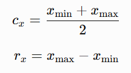

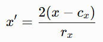

The corresponding transformations for (y) and (z) are

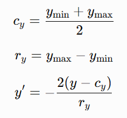

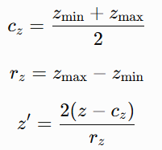

Thus, for each non-degenerate axis, 

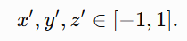

The (y)-axis is explicitly inverted to maintain the expected visualization orientation.

---

### 2.2 Max Cells
For very large datasets, users can restrict the number of points loaded into the browser using **Max Cells**.

Let:

+ (N) = total number of points in the source;
+ (C) = user-defined Max Cells;
+ (M) = number of points loaded into the browser.

Then

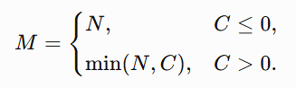

The original row corresponding to browser point (i) is

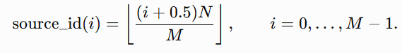

This procedure performs **deterministic approximately uniform sampling along the original file row order**. It is neither random sampling nor spatially stratified sampling.

The mapping between loaded points and their original matrix rows is retained internally and subsequently used to map labels and molecular values onto the displayed points.

---

## 3. Project preparation
### 3.1 Project selection
MAPS-Explorer organizes analyses into projects. Selecting a project initializes a project identifier and invalidates state associated with a previously loaded project.

Project-specific state includes:

+ available files;
+ processed stems;
+ aligned sources;
+ label metadata;
+ gene lists;
+ point buffers;
+ Surface caches;
+ previous analysis results.

Project selection does not imply that processing or alignment has already been completed.

---

### 3.2 Source status
Each processed or aligned source has a lightweight status endpoint used by the interface to determine whether the requested data are available.

A source status describes computational readiness rather than browser download progress. Consequently, a large coordinate file can still be downloading after the server-side process has reached 100%.

---

## 4. Data processing
### 4.1 Processing an individual dataset
The Process module converts an input H5AD dataset into formats optimized for interactive random access.

The server reads:

+ spatial coordinates;
+ `obs` annotations;
+ expression matrices;
+ gene names.

Coordinates, annotations, and molecular measurements retain the same row ordering.

The processed output contains:

+ binary spatial coordinates;
+ binary annotation fields;
+ indexed compressed gene-expression blocks;
+ a stable gene-name list;
+ annotation metadata.

Temporary results are not considered valid processed outputs until processing completes successfully.

---

### 4.2 Batch processing
**Process All** applies the same procedure to multiple project files.

Progress represents the number or stage of completed processing operations rather than instantaneous CPU utilization or byte-level file-reading progress.

When several files are processed sequentially, the displayed percentage can therefore change discontinuously at file boundaries.

---

## 5. Binary data representation
### 5.1 Categorical annotations
Categorical annotations contain:

1. the number of observations;
2. a categorical-type identifier;
3. the number of categories;
4. a UTF-8 category dictionary;
5. one `uint16` category code per observation.

A code of `0xFFFF` represents a missing category.

Because categories can be naturally sorted and recoded, MAPS-Explorer associates colors with **category names** rather than assuming a stable category index.

---

### 5.2 Numerical annotations
Numerical fields contain:

+ number of observations;
+ field type;
+ global minimum;
+ global maximum;
+ one `float32` value per observation.

This format is used by numerical annotations and several derived analysis responses.

---

## 6. Molecular expression storage
To avoid loading an entire expression matrix into browser memory, MAPS-Explorer stores each gene as an individually addressable compressed block.

For each gene, an index records:

+ compressed offset;
+ compressed block length;
+ number of non-zero elements;
+ minimum expression;
+ maximum expression.

A gene block contains:

+ `int32` row indices for non-zero observations;
+ `uint8` quantized molecular measurements.

Given a quantized value (q),

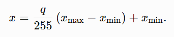

Rows absent from the block are interpreted as zero.

---

## 7. Spatial alignment
### 7.1 Global Align
Global Align constructs a combined coordinate representation from processed input datasets and writes the resulting source into the project alignment directory.

After alignment, the 3D viewer reloads aligned data rather than reusing the original processed coordinates.

The merged point order must remain stable because the same row ordering is used to associate coordinates with:

+ source files;
+ slices;
+ annotations;
+ gene-expression blocks.

---

### 7.2 Alternative alignment sources
MAPS-Explorer can expose different aligned data products through independent sources, including:

+ Global Align;
+ Reference Align;
+ Impute Align.

Each source maintains separate output directories and state.

Changing source invalidates source-specific coordinate, annotation, and analytical caches.

---

## 8. 2D Slice Visualization
The 2D viewer operates on a selected processed data stem.

The standard loading sequence is:

1. discover available processed slices;
2. select a stem;
3. load coordinates;
4. normalize coordinates;
5. apply Max Cells;
6. create the WebGL position buffer;
7. load requested annotations or molecular values;
8. map those values back to the loaded point indices.

For ordinary 2D datasets, changing a label generally updates only the color buffer and does not require reloading coordinates.

---

## 9. 3D Visualization
### 9.1 Source selection
The 3D viewer first identifies available spatial sources and then loads:

+ coordinate positions;
+ available annotation columns.

Coordinate availability does not guarantee that annotation metadata are available.

---

### 9.2 Rendering
Point locations are stored in a WebGL `ARRAY_BUFFER`.

Rendering is performed using

```javascript
gl.drawArrays(gl.POINTS, 0, N);
```

The vertex shader applies:

+ XYZ compression;
+ coordinate flipping;
+ global rotation;
+ thick-slab clipping;
+ camera transforms;
+ projection.

The fragment shader generates circular points from `gl_PointCoord`.

---

## 10. LABELS
### 10.1 Categorical labels
Users can select any available categorical field.

The field is decoded and mapped to the currently loaded point set using the original-row mapping retained after Max Cells sampling.

Users can:

+ show or hide categories;
+ recolor individual categories;
+ combine LABELS with filters or file visibility.

Hidden categories normally remain in the GPU position buffer but receive zero alpha.

---

### 10.2 Numerical labels
Numerical fields are normalized using their stored range and mapped to a continuous color scale.

Additional controls can filter low values or alter minimum point visibility.

---

### 10.3 Dark Min Alpha
**Dark Min Alpha** is designed specifically for numerical-expression visualization.

Instead of making low-expression cells completely invisible, the renderer maintains a minimum alpha for these points.

This mechanism should not be interpreted as a general transparency model for all categorical rendering.

---

## 11. Advanced Filter
Advanced Filter applies an additional categorical constraint to the currently loaded point population.

The workflow is:

1. select a filter column;
2. load that categorical field;
3. select permitted categories;
4. activate the filter.

If the loaded field has original dataset length, the filter uses the Max Cells row map to identify the correct value for each displayed point.

This distinction is essential because using browser point index (i) directly after subsampling would assign annotations to the wrong cells.

### Downstream modules that use Advanced Filter
The filter contributes to:

+ point-cloud visibility;
+ Cell Density;
+ selected Label Shell pathways.

The currently effective Molecular Heterogeneity implementation does **not** use Advanced Filter.

---

## 12. File visibility
When an aligned model contains multiple input datasets, a dedicated file annotation records the source file associated with each point.

Users can hide or restore individual files.

Hiding a file:

+ changes point visibility;
+ affects Cell Density;
+ does not delete coordinate arrays;
+ does not delete molecular-expression caches.

Consequently, files can be restored without reloading the entire model.

---

## 13. Point rendering controls
### 13.1 Point size
Point Size controls the shader point-size parameter.

The final apparent size also depends on:

+ camera distance;
+ perspective projection;
+ device pixel ratio;
+ image-export scaling.

---

### 13.2 Opacity
Global point opacity is multiplied with per-point alpha.

For opaque rendering, depth writes provide stable occlusion.

For semitransparent rendering, conventional WebGL depth behavior can produce viewing-direction-dependent differences because ordinary alpha blending is not strictly order independent.

MAPS-Explorer therefore uses separate rendering strategies for ordinary transparency and the specialized low-expression transparency path.

---

## 14. XYZ slicing
MAPS-Explorer provides independent slicing controls for the (x), (y), and (z) axes.

For an axis with center (c) and thickness (t), retained positions lie within

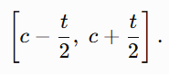

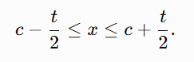

Point clipping is performed in the shader rather than by deleting coordinates from browser memory.

### Compression versus slicing
**Thickness** controls which points are visible.

**Compression** changes how coordinates are displayed.

These are independent operations.

---

## 15. Global Shell
Global Shell reconstructs an approximate continuous boundary from the point cloud.

Importantly, the algorithm is **not** a convex hull and is **not** Poisson surface reconstruction.

The conceptual pipeline is

```plain
Point cloud
    ↓
Voxel-density construction
    ↓
Density filtering / morphology
    ↓
Gaussian smoothing
    ↓
Isosurface extraction
    ↓
Marching Cubes
    ↓
Connected-component filtering
```

The production Global Shell uses the standard shell worker and can operate on up to approximately 200,000 sampled points.

Before volumetric reconstruction,

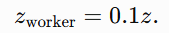

After reconstruction,

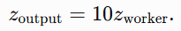

Normals are rescaled accordingly and renormalized.

This temporary anisotropic transformation encourages continuity when the dataset consists of relatively few spatial sections separated by large inter-section gaps. It should not be interpreted as biological interpolation.

---

## 16. Label Shell
Label Shell reconstructs surfaces for selected categorical groups.

Two reconstruction modes are available:

+ **Strict**
+ **Smooth**

The same interface parameters are exposed to both modes, but separate parameter presets are retained.

---

## 17. Strict Label Shell
Strict mode is designed to preserve local concavities, holes, disconnected structures, and fine boundary features.

The processing sequence is

```plain
categorical point selection
    ↓
voxel-density construction
    ↓
low-density filtering
    ↓
Gaussian smoothing
    ↓
threshold-based isosurface extraction
    ↓
Marching Cubes triangulation
    ↓
connected-component filtering
    ↓
mesh sealing and normal correction
```

When **Split by Label** is enabled, each visible category is reconstructed independently.

When disabled, the selected points are reconstructed as a combined population.

Approximately 200,000 points can be used per strict reconstruction group, with deterministic step-based sampling when necessary.

---

### 17.1 Surface Fit
The Strict mode isosurface threshold is determined from the user-defined Surface Fit parameter (f):

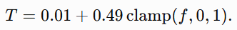

Changing Surface Fit alters the density isovalue used by Marching Cubes; it does not directly move individual biological cells.

---

### 17.2 Density
Density controls low-density voxel suppression prior to surface extraction.

Increasing this value preferentially removes sparse regions.

---

### 17.3 Tolerance
Connected components are ranked by size.

Tolerance determines which smaller components are discarded relative to the dominant structures.

It therefore acts primarily on **component retention**, not point displacement.

---

### 17.4 Offset
Offset translates reconstructed surface vertices along their normals.

For vertex v, unit normal n, and offset (d),

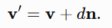

---

## 18. Smooth Label Shell
Smooth mode is intended for serial-section datasets in which large or irregular physical spacing between slices would otherwise dominate surface connectivity.

Rather than reconstructing directly in physical (z), Smooth mode first identifies individual slices.

Physical slice coordinates are clustered using a tolerance approximately equal to

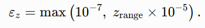

The detected slices are then assigned sequential indices:

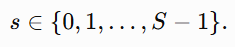

Each point's original (z) coordinate is replaced by the corresponding slice index for reconstruction.

The reconstructed surface is subsequently mapped back to physical (z) by piecewise-linear interpolation between adjacent sections.

### Computational constraints
The current implementation approximately limits:

+ each label to 60,000 points;
+ Worker concurrency to two;
+ reconstruction resolution to approximately 48;
+ smoothing to no more than three passes;
+ total processing time to approximately 4.9 s for this interactive pathway.

---

## 19. Shell mesh sealing and normal repair
Shell meshes undergo additional topology repair.

The procedure:

1. welds vertices after coordinate quantization;
2. removes degenerate triangles;
3. removes duplicate triangles;
4. identifies boundary edges;
5. assembles compatible boundary loops;
6. inserts a center point to cap closed loops;
7. corrects triangle winding where necessary;
8. recalculates area-weighted smooth normals.

Apparent holes with unusual lighting or material appearance can therefore reflect inconsistent triangle winding or inverted normals rather than genuinely missing geometry.

---

## 20. Analyze Surface
Analyze Surface operates on a **Label Shell mesh**, not directly on the original cells.

The module decomposes surfaces into connected components and reports geometric descriptors.

---

### 20.1 Component identification
Mesh vertices have the structure [x, y, z, n_x, n_y, n_z].

Coordinates are quantized at approximately (10^-4) precision to define shared vertices.

Triangles sharing quantized vertices are connected using a union-find procedure.

Components are ranked by triangle count, and components containing fewer than two triangles are discarded.

---

### 20.2 Surface area
For triangle vertices (a,b,c),

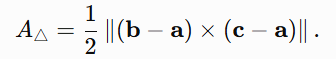

Component area is

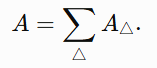

---

### 20.3 Surface volume
Each triangle contributes a signed tetrahedral volume

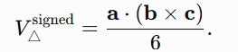

The reported component volume is

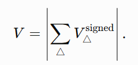

#### Important interpretation
Volume is reliable only when the reconstructed mesh is sufficiently closed, consistently oriented, and free of severe self-intersections.

---

### 20.4 What does “cells” mean in Surface Display?
The current implementation does **not** perform exact point-in-polyhedron counting.

Instead, a cell is counted when it lies inside the component's axis-aligned bounding box:

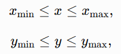

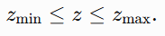

Accordingly, the value should be interpreted as **bounding-box coverage cells **rather than **cells enclosed by the reconstructed surface**.

For curved, concave, or obliquely oriented objects, points may satisfy the bounding-box criterion while remaining outside the actual mesh.

---

## 21. Molecular Heterogeneity and Surface Signal
The Surface Signal workflow maps a molecular or numerical variable onto a reconstructed Label Shell.

Possible targets include:

+ gene expression;
+ numerical `obs` fields.

The procedure consists of:

1. reconstructing or retrieving a Label Shell;
2. sampling positions across the surface;
3. constructing local cylindrical neighborhoods;
4. collecting neighboring cells;
5. aggregating molecular measurements;
6. projecting the resulting signal back to the mesh vertices.

---

### 21.1 Which cells are used?
The currently effective implementation uses all points in the browser's loaded normalized point array.

It does **not** apply:

+ LABELS visibility;
+ Advanced Filter;
+ file visibility;
+ XYZ slab visibility.

However, the calculation remains constrained by Max Cells because the browser point array itself may already have been subsampled.

Thus, “all cells” in this module means:

> all cells currently loaded into the browser after Max Cells sampling.
>

It does not necessarily mean all cells stored in the project.

---

## 22. Surface spatial index
To accelerate neighborhood searches, Surface analysis constructs a uniform three-dimensional grid using a CSR-like representation.

The index contains:

+ number of points per grid cell;
+ prefix-sum offsets;
+ point indices arranged contiguously by cell.

A default spatial-index cell width of approximately 0.04 is used initially.

When the number of grid cells would exceed approximately two million, the cell width is repeatedly increased.

When a Surface molecular radius (r) has been determined, the preferred index spacing becomes

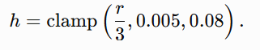

The index only eliminates points that cannot belong to the neighborhood. Final membership is always determined using the exact cylindrical equation.

---

## 23. Deterministic surface sampling
The number of surface samples is user-configurable between approximately 1,000 and 5,000.

Importantly, **Sample Points refers to the number of samples per surface part**, not the total across all parts.

Triangles are sampled according to their surface area.

For sample (s),

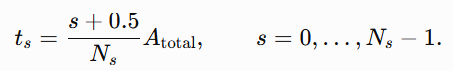

A cumulative area distribution identifies the target triangle.

Within that triangle, MAPS-Explorer uses a deterministic low-discrepancy sequence:

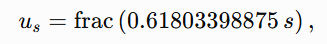

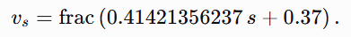

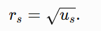

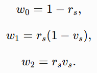

The sampled coordinate is

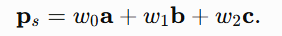

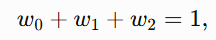

Normals are interpolated with the same weights and normalized.

Because this procedure is deterministic rather than random, repeated runs with identical geometry and parameters are reproducible.

---

## 24. Automatic Surface molecular radius
When an automatic spatial radius is used, MAPS-Explorer combines an estimate based on surface area with one based on three-dimensional point-cloud coverage.

The surface-spacing estimate is

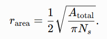

The volume-coverage estimate is

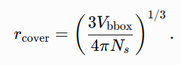

The final radius is

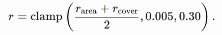

This radius is expressed in normalized MAPS-Explorer coordinate units rather than a physical tissue-distance unit.

---

## 25. Cylindrical molecular neighborhood
For surface sample position (p), unit surface normal (n), and cell coordinate (q),

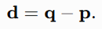

The axial displacement is

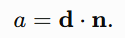

The squared radial distance is

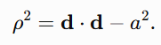

A cell belongs to the neighborhood when

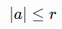

and

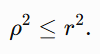

Thus each neighborhood is a cylinder with:

+ radius (r);
+ half-height (r);
+ total height (2r).

Cells are assigned relative to the surface by the sign of (a):

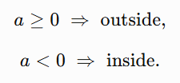

---

## 26. Surface Gene Expression
For conventional molecular surface mapping, the signal assigned to surface sample (s) is

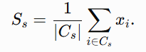

where (C_s) is the set of cells contained in the sample cylinder.

Only finite expression measurements contribute.

The resulting sample signal is transferred to mesh vertices using the nearest sampled surface point.

The current implementation therefore does not continuously interpolate between multiple neighboring samples.

---

## 27. Surface Molecular Gradient
When **Surface Molecular Gradient** is enabled, separate means are calculated on the two sides of the surface:

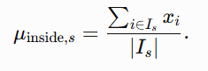

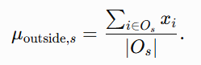

The reported gradient is

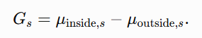

Therefore:

+ (G>0): molecular abundance is higher on the inside;
+ (G<0): molecular abundance is higher on the outside;
+ (G≈0): no strong directional difference is detected at the selected spatial scale.

When one side contains no valid cells, that side's mean is treated as zero.

The sign convention is always **inside minus outside**.

---

### 27.1 Why are the reported cell counts decimal numbers?
For every surface sample, contained, inside, and outside cell numbers are integers.

The interface reports averages across all sampled cylinders:

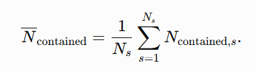

These averages can therefore be non-integers.

---

## 28. Surface CPU/WebGPU acceleration
WebGPU acceleration, when available, is restricted primarily to classification of candidate cells into cylindrical neighborhoods.

Other operations remain CPU-based, including:

+ grid construction;
+ surface sampling;
+ bucket enumeration;
+ molecular aggregation;
+ mesh-vertex mapping.

The browser attempts WebGPU acceleration only under suitable conditions, including sufficiently large datasets and a secure execution environment.

GPU classifications are sampled and checked against the CPU cylindrical equation.

A disagreement disables the GPU pathway and triggers CPU fallback.

Therefore, limited total CPU utilization does not necessarily imply that the calculation can simply be parallelized without additional memory-transfer or synchronization costs.

---

## 29. Surface caching
MAPS-Explorer maintains a persistent Surface Worker and several caches.

Cached objects can include:

+ spatial point index;
+ processed surface geometry;
+ molecular neighborhoods.

When shell geometry, sample number, molecular radius, and point population remain unchanged, switching from one gene to another can reuse previously constructed cylindrical neighborhoods.

Changing any of the following can invalidate the cache:

+ Shell geometry;
+ sample number;
+ radius;
+ loaded point population;
+ relevant geometry state.

This design substantially reduces repeated molecular-surface query costs.

---

## 30. Surface Region Analysis
Surface Region Analysis extracts a selected portion of an already reconstructed surface.

Users first define one or more XYZ slabs.

The intersection of active intervals forms a three-dimensional clipping box.

The existing surface mesh is clipped against this box and displayed independently.

### Important interpretation
This module does **not** regenerate a local Shell from cells inside the selected region.

The newly exposed clipping planes are therefore computational cut boundaries, not inferred biological surfaces.

The module is intended for spatial inspection, sectional visualization, and focused analysis of already reconstructed structures.

---

## 31. Cell Density Viewer
Cell Density Viewer transforms spatial point distributions into continuous density surfaces.

Unlike Molecular Heterogeneity, its input explicitly respects the active visualization filters.

The input population can therefore reflect:

+ XYZ slabs;
+ hidden labels;
+ Advanced Filter;
+ file visibility;
+ missing categories.

---

### 31.1 Two-dimensional histogram
All visible labels share one spatial bounding box.

The range is expanded by approximately 10% on each side.

For grid resolution (n),

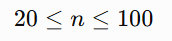

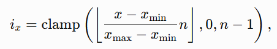

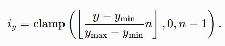

Each cell increments the grid associated with its local categorical label.

Using one shared bounding box ensures that density surfaces from different labels are evaluated on the same spatial scale.

---

## 32. Density smoothing
The Smoothing parameter is interpreted as the Gaussian standard deviation σ.

Kernel radius is

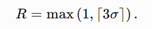

The one-dimensional kernel is

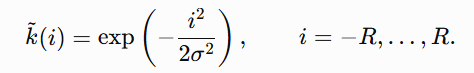

followed by normalization,

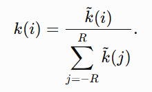


Convolution is performed separately in the horizontal and vertical directions.

The outermost rows and columns are subsequently forced to zero to prevent visually open density surfaces extending beyond the section boundary.

---

## 33. Density height
All cell types share one global peak value:


Displayed height is


Thus, heights are directly comparable across displayed labels.

---

## 34. Density transparency
For each label (l), let


Local relative height is


Fragment transparency is then approximately


Consequently:

+ density **height** is normalized globally across labels;
+ density **opacity** is modulated relative to each label's own peak.

This distinction is important when comparing the visual prominence of two cell populations.

---

## 35. Collapse Axis
Cell Density is fundamentally calculated as a two-dimensional projected density.

**Collapse Axis** determines how this two-dimensional density surface is displayed in the three-dimensional viewer.

For example:

+ Z collapse uses the current XY plane;
+ X or Y collapse remaps the density plane through the vertex shader.

Collapse Axis does not convert the method into a three-dimensional kernel-density estimator.

---

## 36. Spatial Gene Interaction
Spatial Gene Interaction provides interactive visualization of molecular co-occurrence among user-defined groups of genes.

Three input groups are available:

+ Ligand;
+ Receptor;
+ Expand.

The module is designed for spatial hypothesis exploration and expression-pattern inspection.

It is **not** a probabilistic cell–cell communication inference framework.

---

### 36.1 Gene-level normalization
Each requested gene (g) is independently min–max normalized:


---

### 36.2 Group aggregation
For selected ligand genes,


Similarly,


The returned group fields are independently normalized again in the browser before the user-defined Expression Filter is applied.

---

## 37. Interaction state classification
Following thresholding, each point receives a three-bit state:


Possible states therefore include:

+ L;
+ R;
+ L+R;
+ E;
+ L+E;
+ R+E;
+ L+R+E.

Each combination can be assigned a distinct color.

Default colors approximately correspond to:

+ L: blue;
+ R: green;
+ L+R: yellow;
+ E: red;
+ L+E: purple;
+ R+E: orange;
+ L+R+E: white.

Users can overwrite this palette.

---

### 37.1 Interaction alpha
Point transparency is based on the strongest active group:


The exponent (0.35) enhances visualization of intermediate and relatively weak signals.

---

## 38. Coexpression
Coexpression combines genes entered across the interaction input fields.

After gene-level normalization, a row-wise product is calculated:


The resulting single field is currently loaded into the ligand visualization channel.

Consequently, Coexpression presently uses a **single ligand-channel color** rather than the seven-state Ligand/Receptor/Expand combination palette.

---

## 39. What Spatial Gene Interaction does not calculate
The current module does not include:

+ a ligand–receptor interaction database;
+ sender–receiver directionality;
+ spatial-distance weighting kernels;
+ permutation testing;
+ interaction (P) values;
+ pathway kinetics;
+ communication probabilities.

Accordingly, results should be described as

**spatial molecular co-occurrence or interaction-pattern visualization**

rather than

**inferred cell–cell communication probability**.

---

## 40. Spatially Variable Gene statistics
MAPS-Explorer provides a lightweight spatial autocorrelation ranking intended for rapid exploratory queries.

The server samples


Sample indices are deterministically distributed across original row order.

A `cKDTree` is constructed in either:

+ XY for 2D;
+ XYZ for 3D.

For every sampled observation, up to eight non-self nearest neighbors are retained.

For expression vector (x), define the mean expression among spatial neighbors:


The spatial score is


Scores are bounded to


Genes with insufficient non-zero values, negligible variance, or non-finite statistics receive a score of zero.

### Interpretation
Higher positive values indicate stronger agreement between a cell's gene expression and the average expression of its local spatial neighbors.

### Important limitation
This score is **not Moran's I**, SpatialDE, or another formal spatial-variable-gene test.

No permutation-derived significance test or multiple-testing correction is calculated.

---

## 41. Marker Gene Statistics
Marker Statistics quantifies how strongly the selected categorical annotation explains variation in each gene.

For expression x_i, overall mean μ, group (g) containing n_g observations, and group mean μ_g,


The reported score is the effect-size statistic


When total expression variance approaches zero, the score is set to zero.

The interface also reports the category with the highest mean expression as the **Top label**.

### Interpretation
η^2 is the fraction of total expression variance explained by the selected categorical annotation.

### What it is not
The statistic is not:

+ fold change;
+ differential-expression significance;
+ a (P) value;
+ a direction-specific upregulation statistic.

A gene may therefore receive a high η^2 because expression differs strongly among groups even when its biological interpretation requires additional inspection.

---

## 42. Spatial statistics execution and caching
Spatial Gene and Marker Statistics are calculated server-side.

A common workflow is used:

1. define project/source/stem scope;
2. construct a normalized analysis request;
3. search for an existing cached result;
4. create an analysis task if required;
5. construct spatial or categorical context;
6. process genes in parallel;
7. update progress;
8. sort all results;
9. write a temporary result file;
10. atomically replace the previous saved result.

Approximately two spatial-statistics tasks can execute concurrently at the server level.

The complete ranked result is retained rather than only the first 100 genes.

---

## 43. Model Frame
Model Frame provides a three-dimensional reference box and dimension annotations around the normalized model.

With frame expansion (e),


defines the frame extent in normalized coordinates.

A user-specified dimension (D) is displayed as


The frame follows:

+ coordinate compression;
+ axis flipping;
+ model rotation;
+ perspective projection.

Frame edges remain depth tested, meaning that edges behind the tissue can be naturally occluded.

---

## 44. Dimension marks
Dimension labels are positioned relative to the observer rather than statically attached to one screen edge.

This helps maintain readable:

+ X dimensions;
+ Y dimensions;
+ Z dimensions

while the model rotates.

These annotations are visualization references and do not reverse the earlier independent coordinate normalization unless the displayed dimensions are explicitly configured to represent physical values.

---

## 45. Auto Rotate
Auto Rotate continuously updates the model rotation.

Users can control:

+ speed;
+ clockwise/counter-clockwise direction.

Reset View clears accumulated translation, zoom, and rotation state.

Auto Rotate changes only the camera/model transformation and does not recompute molecular or geometric analyses.

---

## 46. Image export
High-resolution figure export temporarily enlarges the WebGL drawing buffer.

The export sequence redraws:

+ point clouds;
+ Global Shell;
+ Label Shell;
+ Surface signals;
+ Cell Density surfaces;
+ XYZ slab frames;
+ Model Frame.

Screen-space features including:

+ line width;
+ tick length;
+ text size

must be increased according to the high-resolution scaling factor.

SVG or HTML overlays require explicit compositing with the WebGL canvas. Otherwise, a saved figure can contain the rendered tissue but omit annotation overlays.

After export, the original interactive viewport and rendering scale are restored.

---

## 47. Project configuration
Project configuration distinguishes between parameters that affect only rendering and parameters that require recomputation.

### Rendering-only parameters
Typical examples include:

+ point size;
+ point opacity;
+ Shell opacity;
+ Shell outline;
+ lighting;
+ Auto Rotate speed;
+ Auto Rotate direction;
+ Model Frame appearance.

These usually take effect during subsequent rendering without rebuilding the underlying geometry.

### Geometry or analysis parameters
Typical examples include:

+ Shell tolerance;
+ Shell smoothing;
+ Shell density;
+ Surface Fit;
+ Shell offset;
+ Density resolution;
+ Density smoothing;
+ Surface Sample Points;
+ Surface molecular radius;
+ Max Cells.

Changing these parameters requires corresponding geometry, neighborhood, density, or point buffers to be recalculated.

---

## 48. Error handling and asynchronous state
MAPS-Explorer performs many operations asynchronously.

Every long-running request must remain associated with the corresponding:

+ project;
+ source;
+ stem;
+ task;
+ request identifier.

If the user changes project or source before a request completes, a late response must not overwrite the new state.

Dedicated request sequences are used to reject obsolete Density and Surface Worker responses.

Workers are explicitly terminated on timeout or cancellation.

Transferred `ArrayBuffer` objects become detached in the sending execution context. Data that must remain accessible are therefore copied before transfer when required.

---

## 49. Memory considerations
For (P) loaded points, approximate browser memory requirements include:


bytes for 3D positions,


bytes for point colors,


bytes for source-row mapping,


bytes for categorical labels,

and


bytes for numerical labels.

For (L) categories and density resolution (n), the density grid alone requires approximately


bytes before temporary convolution arrays are considered.

The triangulated density mesh requires approximately


bytes.

Shell vertices require approximately 24 bytes per vertex.

Surface analysis additionally stores:

+ numerical vertex signals;
+ vertex colors;
+ spatial-index arrays;
+ neighborhood indices;
+ side classifications;
+ sample-to-vertex mappings.

GPU candidate classification can temporarily create additional large arrays.

---

## 50. User question: Why do I get “Array buffer allocation failed”?
This error usually indicates that several large arrays coexist in browser memory.

It does not necessarily mean that one individual array exceeds the theoretical JavaScript TypedArray limit.

Useful mitigations include:

1. decreasing Max Cells;
2. decreasing Surface Sample Points;
3. removing obsolete Shell or Surface geometry;
4. clearing molecular-neighborhood caches before rebuilding substantially different geometry;
5. reducing Cell Density resolution when many labels are displayed simultaneously.

---

## 51. Reproducibility
Several major computational steps are deterministic:

+ Max Cells row sampling;
+ Spatial Gene/Marker row sampling;
+ low-discrepancy Surface sampling;
+ Shell point-step sampling;
+ quantized gene-expression decoding.

Identical inputs and identical parameters therefore generally reproduce identical selections and analytical values.

However, results can still change when users alter:

+ original row ordering;
+ Max Cells;
+ Shell geometry;
+ label vocabularies;
+ molecular quantization;
+ sampling parameters;
+ Surface radius.

---

## 52. Interpretation guide
### “Cells” in Analyze Surface
Interpret as:

> number of points covered by the component's axis-aligned bounding box.
>

Do not interpret as exact cells enclosed by the mesh.

### Molecular Heterogeneity
Interpret as:

> molecular measurements calculated from all browser-loaded cells around sampled surface locations.
>

Do not assume current label, file, Advanced Filter, or slab visibility is applied.

### Molecular Gradient
Interpret as:


### Sample Points
Interpret as:

> number of sampled positions per surface part.
>

### Cell Density height
Interpret as:

> density normalized against the global maximum across displayed labels.
>

### Cell Density transparency
Interpret as:

> opacity modulated relative to the individual label's own density peak.
>

### Spatially Variable Gene score
Interpret as:

> Pearson correlation between expression and local KNN-neighbor mean expression.
>

Do not report it as Moran's I.

### Marker score
Interpret as:

> η^2, the proportion of expression variance explained by the selected annotation.
>

Do not report it as differential-expression significance.

### Spatial Gene Interaction
Interpret as:

> visualization of spatially coincident normalized gene-group expression.
>

Do not report it as a statistically inferred communication probability.

### Coexpression
Interpret as:

> multiplicative coexpression of individually normalized genes displayed through the ligand color channel.
>

### Smooth Shell
Interpret as:

> surface reconstruction in slice-index space followed by mapping back to physical slice coordinates.
>

### Strict Shell
Interpret as:

> surface reconstruction that more directly retains the geometry of the normalized point cloud and therefore more readily preserves local gaps, concavities, and disconnected regions.
>

These implementation-specific interpretation boundaries are essential for reproducible reporting of MAPS-Explorer analyses.

---

## 53. Summary
MAPS-Explorer couples indexed molecular storage, deterministic subsampling, WebGL visualization, dedicated parallel Workers, surface reconstruction, spatial indexing, molecular boundary analysis, density reconstruction, spatial co-occurrence visualization, and lightweight spatial statistics within a unified interactive environment.

Its principal analytical advantage is the ability to move continuously between the original spatial point representation and derived geometric representations of tissue organization. Users can therefore query not only where cells or molecules are located, but also how molecular signals relate to reconstructed boundaries, how densities vary across tissue regions, how molecular programs co-occur spatially, and how gene expression associates with local spatial structure or categorical cell states.

At the same time, MAPS-Explorer deliberately distinguishes visualization-oriented statistics from formal inferential models. Surface cell counts are bounding-box coverage measurements rather than exact mesh-enclosure counts; Surface Molecular Gradient is an inside-minus-outside local mean difference; Spatially Variable Gene statistics are KNN-neighbor correlations rather than Moran's I; Marker Statistics report η^2 rather than differential-expression significance; and Spatial Gene Interaction visualizes expression co-occurrence rather than estimating communication probability.

These distinctions provide a clear computational basis for using MAPS-Explorer both as an exploratory spatial-analysis environment and as a reproducible visualization and measurement framework for large-scale two- and three-dimensional spatial omics studies.

