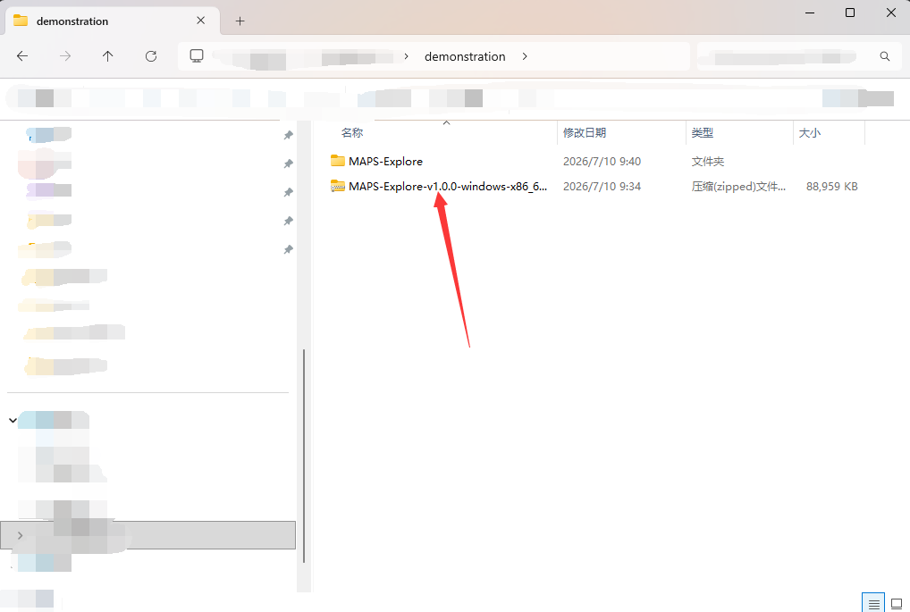
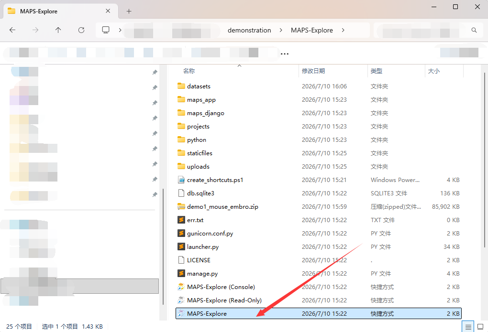
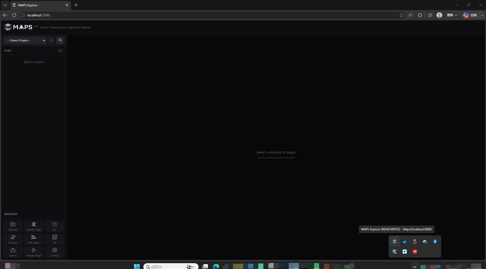
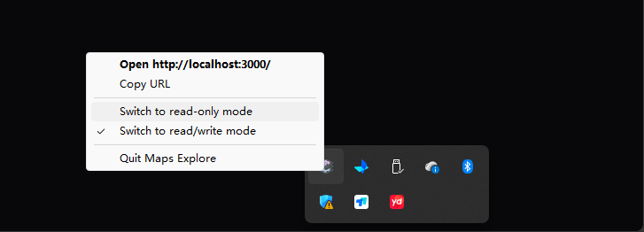
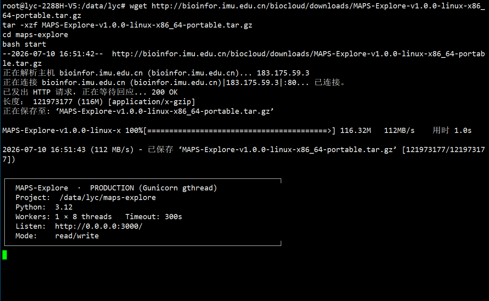
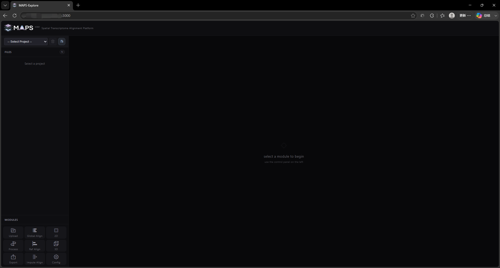
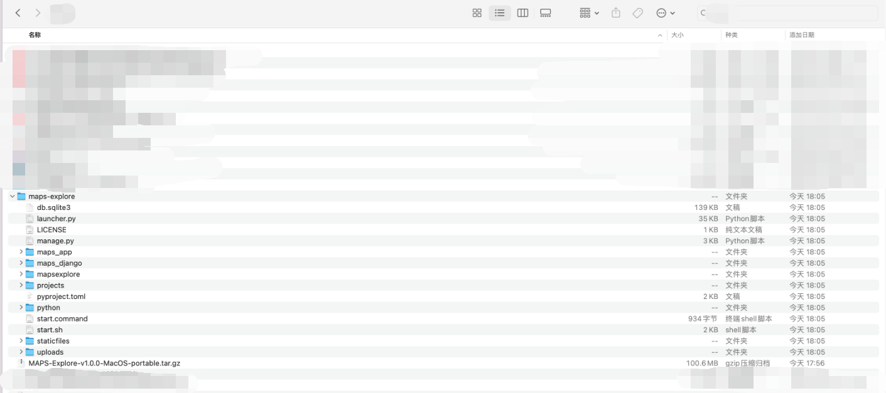
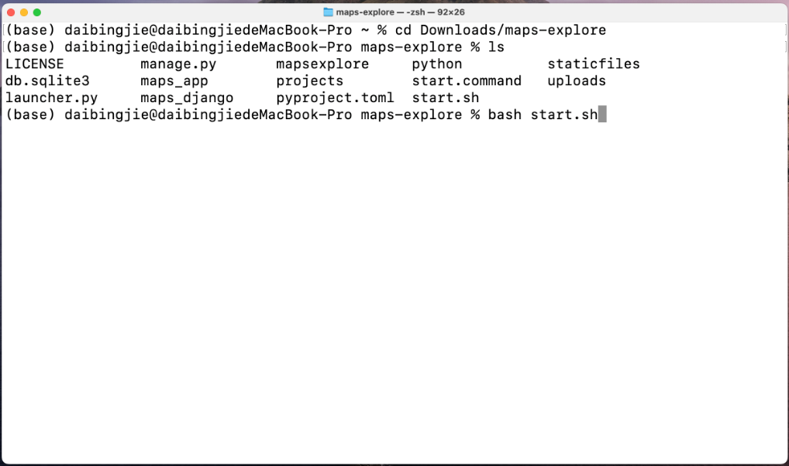
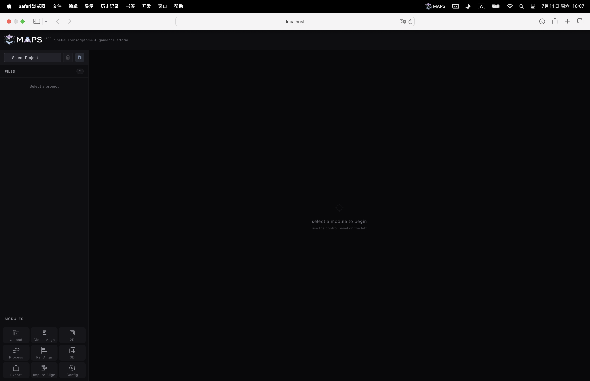
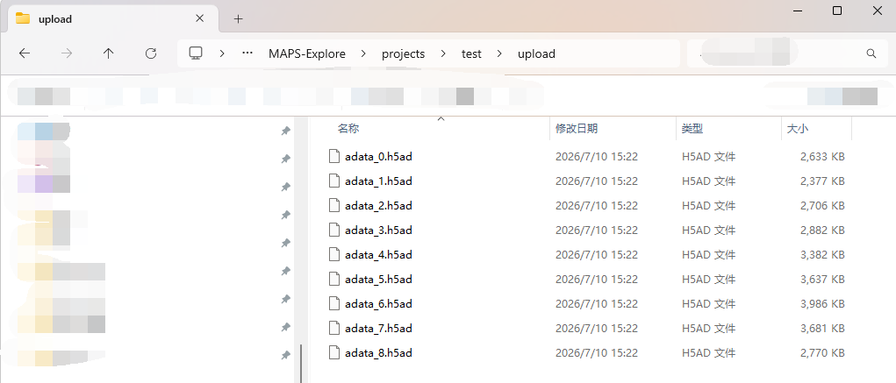

# 1. Deploying MAPS-Explore

## 1.1 Installing MAPS-Explore on Windows

Windows users can download and extract this archive: [MAPS-Explore-v1.0.0-windows-x86_64-portable.zip](https://zenodo.org/records/21335018). The application is fully portable — no installation required. However, avoid deploying it under a path that contains Chinese characters.

<!-- 这是一张图片，ocr 内容为： -->


Double-click the executable to launch MAPS-Explore.

<!-- 这是一张图片，ocr 内容为： -->


MAPS-Explore automatically opens the front-end in your default browser and keeps a tray icon running in the system tray.

<!-- 这是一张图片，ocr 内容为： -->


Right-click the tray icon to switch between **Edit mode** and **Presentation mode** (read-only).

<!-- 这是一张图片，ocr 内容为： -->


## 1.2 Installing MAPS-Explore on Linux

Linux users can download and extract this archive: [MAPS-Explore-v1.0.0-linux-x86_64-portable.tar.gz](https://zenodo.org/records/21335018). We recommend Ubuntu 24+ or CentOS 8+. No pre-configuration is required.

```bash
wget http://bioinfor.imu.edu.cn/biocloud/downloads/MAPS-Explore-v1.0.0-linux-x86_64-portable.tar.gz
tar -xzf MAPS-Explore-v1.0.0-linux-x86_64-portable.tar.gz
cd maps-explore
bash start
```

<!-- 这是一张图片，ocr 内容为： -->


You will need a graphical environment to view the front-end panel — either the Linux machine itself (if it has a GUI) or any remote device with a graphical browser. Make sure port 3000 is open in your firewall. If you deploy inside a container or need port forwarding, set up the appropriate port mapping.

<!-- 这是一张图片，ocr 内容为： -->


You can also start in Presentation (read-only) mode as follows:

```bash
bash start --read-only
```

## 1.3 Installing MAPS-Explore on macOS

macOS users can download and extract this archive: [MAPS-Explore-v1.0.0-MacOS-portable.tar.gz](https://zenodo.org/records/21335018).

<!-- 这是一张图片，ocr 内容为： -->


Open a terminal, navigate into the extracted folder, and run the start command. The launch flow is the same as on Linux, and we have adapted the application for macOS and Safari.

```bash
cd Downloads/maps-explore
ls
bash start.sh
```

<!-- 这是一张图片，ocr 内容为： -->


MAPS-Explore will open the default browser, place an icon in the macOS menu bar, and allow mode switching via right-click.

<!-- 这是一张图片，ocr 内容为： -->


## 1.4 Choosing a Run Mode

MAPS-Explore ships with two run modes. Both listen on port 3000 of the host machine.

- **Edit mode** — full functionality, including creating and deleting projects, uploading and downloading slice data, running alignment tasks, and configuring project parameters.
- **Presentation mode (read-only)** — only loads projects and supports 2D/3D visualization. All write operations are disabled. Best for demos and sharing results.

## 1.5 Things to Keep in Mind

- For large 3D visualizations, deploy MAPS-Explore on a disk with plenty of free space. The backend pre-computes tiled and dense-matrix data to keep the front-end responsive, and these artifacts consume disk space.
- Adjust the parallel thread setting for your own hardware (see [Section 2.10 Configuration](./2.10-Configuration_Interface.md)). The default of 8 threads may not work on every machine.
- Avoid project names or installation paths that contain Chinese characters or special symbols; in some environments they cause path-resolution issues.
- Only H5AD files are accepted for upload, and we recommend keeping one file per slice. Although the front-end is accelerated with tiling and parallelism, large uploads can still create bottlenecks. For bulk uploads, locate the `projects/<your-project>/upload` directory on the deployment machine and copy your data directly there.
- <!-- 这是一张图片，ocr 内容为： -->
  
