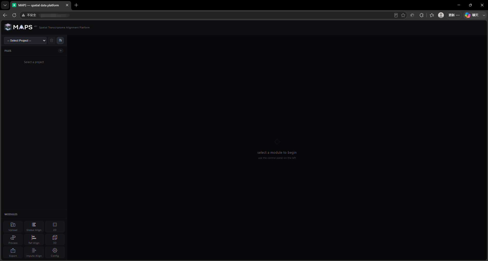

# 2.1 Open MAPS-Explore

If you installed MAPS-Explore locally and your machine has a GUI plus any browser, open:

```
http://127.0.0.1:3000/
```

If you deployed MAPS-Explore on a remote server, open the appropriate firewall ports and use:

```
http://your_ip:3000/
```

If you deployed MAPS-Explore inside a Docker container or need to expose it over the public Internet, set up a port forwarder and use the IP and port of the intermediate host.

<!-- 这是一张图片，ocr 内容为： -->

