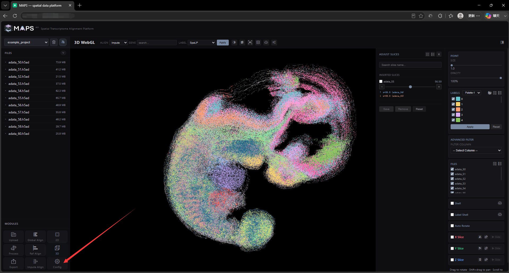
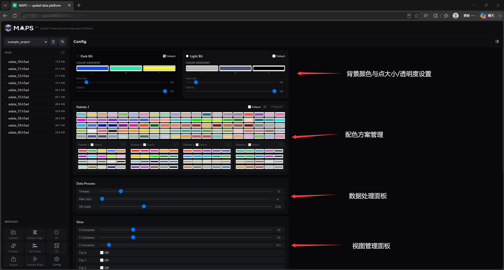
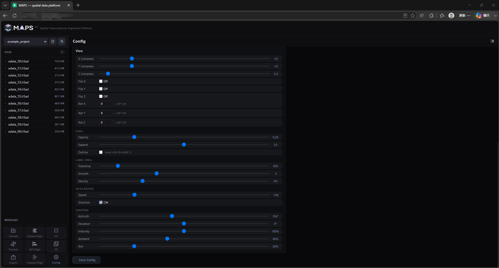
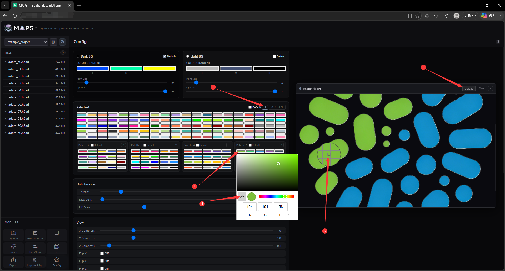

# 2.10 Configuration Interface

Click the **Config** button in the bottom-left corner to open the configuration interface.

<!-- 这是一张图片，ocr 内容为： -->

<!-- 这是一张图片，ocr 内容为： -->

<!-- 这是一张图片，ocr 内容为： -->

The configuration interface lets you preset the project's default visualization parameters. Each project has its own configuration file. Use **Save** after editing to persist your custom panel. The available sections are:

- **Dark / Light BG** — choose the default background color and default point size/opacity for the 2D and 3D windows.
- **Palette** — configure preset color palettes. We ship five palettes: **Palette-1** has 100 preset colors, while **Palette-2** through **Palette-5** each have 20. The default is **Palette-1**. If a label set exceeds 100 categories, MAPS-Explore cycles through the palette and applies small per-point offsets so that no two colors collide visually. A quick picker is included — click the side button next to **Palette-1** to open an image viewer where you can upload a color reference and use the eyedropper tool to assemble a custom palette faster.
  <!-- 这是一张图片，ocr 内容为： -->
  
- **Data Process** — the **Threads** field controls how many threads the **Process** step runs in parallel. **Max Cells** caps the number of cells rendered per slice to reduce front-end load — useful on low-spec client machines. **HD Scale** controls the resolution of saved images; final resolution equals screen resolution × scale. On a 1080p screen, `2x` is enough for clean output. Because of the rendering architecture used, vector formats such as SVG and PDF are not supported.
- **View** — visualization presets for the rendered scene. **XYZ Compress** scales each axis independently; Z defaults to `0.3` so that slices look compact and stacked. **Flip XYZ** mirrors each axis (off by default). **Rot XYZ** rotates each axis (default `0`). The **SHELL** block controls the global voxelization hull — opacity, expansion distance, and outline stroke. The **LABELS SHELL** block has three parameters: **Tolerance** (when a single label contains multiple disjoint clusters, only the top n% are used to build the hull), **Smooth** (number of Gaussian smoothing iterations — more iterations give smoother surfaces but also a larger hull, and over-smoothing can leave the hull open), and **Density** (filters out sparse points so that the main cluster renders cleanly). **AUTO ROTATE** controls the auto-rotation speed and direction. **LIGHTING** controls hull lighting: **Azimuth** (horizontal light angle), **Elevation** (vertical light angle), **Intensity** (directional light strength), **Ambient** (ambient light strength), and **Rim** (rim/specular intensity).
