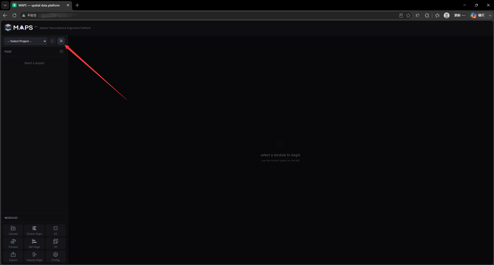
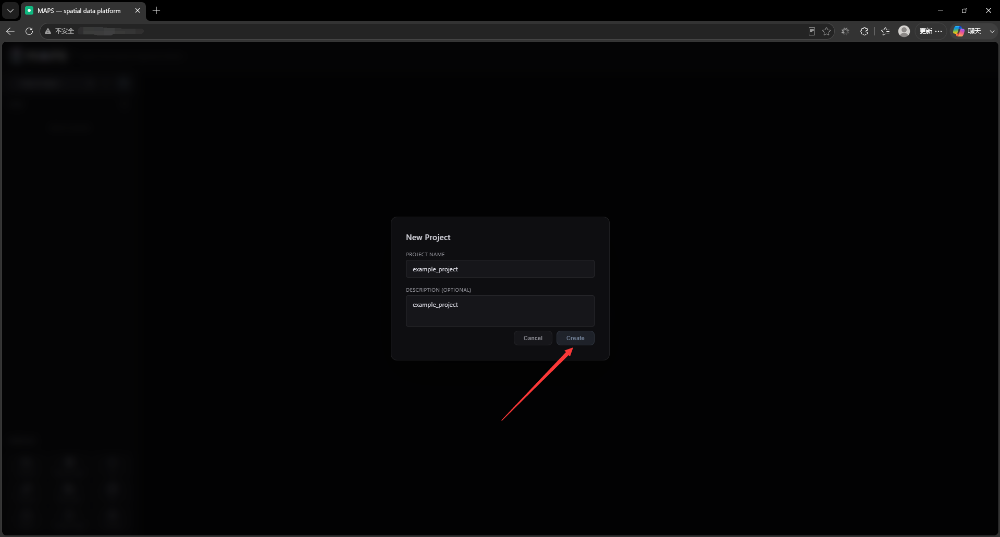
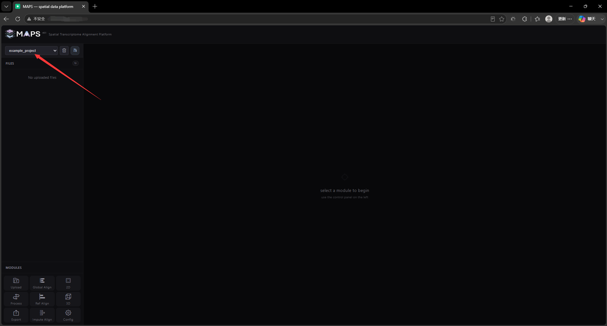

# 2.2 Create a Project

Click the **Create Project** icon in the top-left corner.

<!-- 这是一张图片，ocr 内容为： -->

In the dialog that appears, enter a project name and (optionally) a description. The project name must be in English and cannot contain spaces or special symbols; otherwise the project will fail to load.

<!-- 这是一张图片，ocr 内容为： -->

When the project name appears in the right-hand project tab, it has been created successfully.

<!-- 这是一张图片，ocr 内容为： -->

