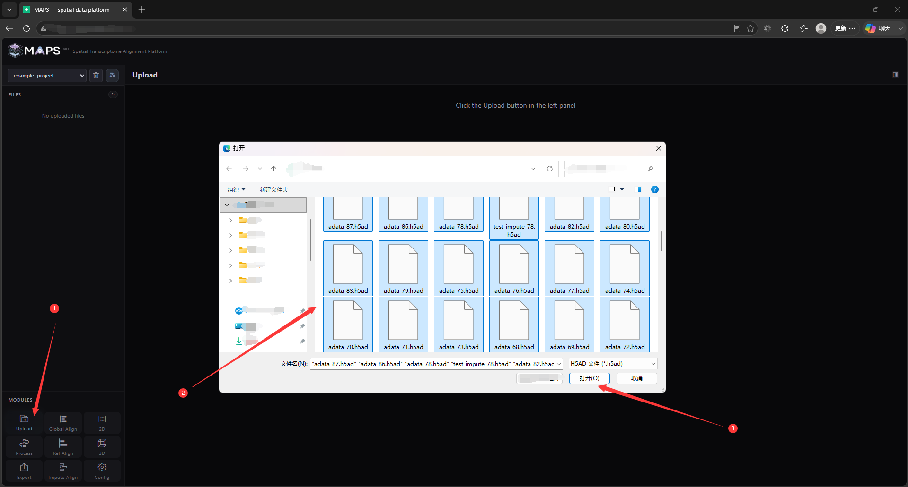
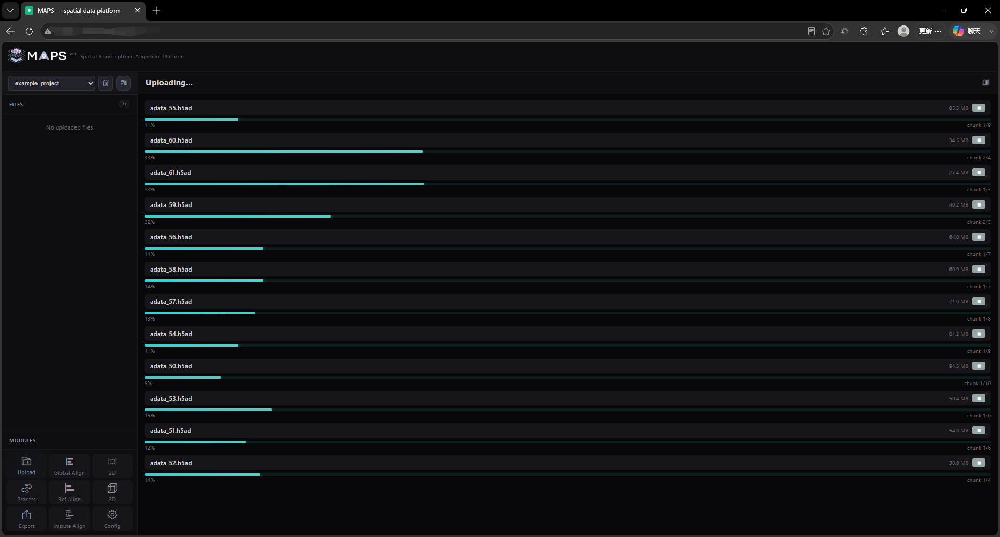
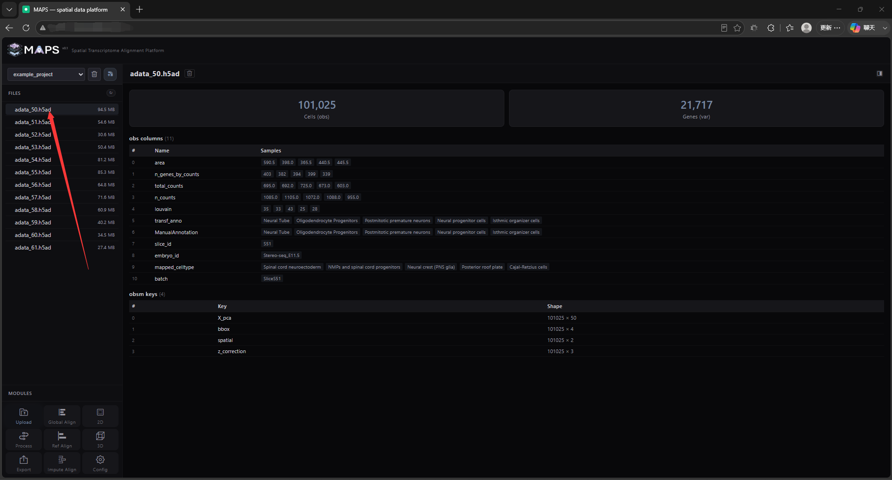

# 2.3 Upload Data

MAPS-Explore currently supports the H5AD format only. To make sure your data is parsed and loaded correctly, we recommend processing and saving the slice files with `anndata==0.12.11` — other versions have not been thoroughly tested.

Click the **Upload** button in the bottom-left corner to select and upload files.

<!-- 这是一张图片，ocr 内容为： -->

Selected H5AD files are uploaded to the backend in batches. Upload speed depends on your bandwidth.

<!-- 这是一张图片，ocr 内容为： -->

Once the upload completes, the files appear in the file tree on the left. Click a file to preview partial file metadata. MAPS-Explore only displays cell count, gene count, `obs`, `obsm`, and `uns` information, and it shows just a sample of the data. We recommend trimming out unnecessary fields from your H5AD files — having too much stored information will slow down both upload and loading. The metadata preview looks like this:

<!-- 这是一张图片，ocr 内容为： -->

