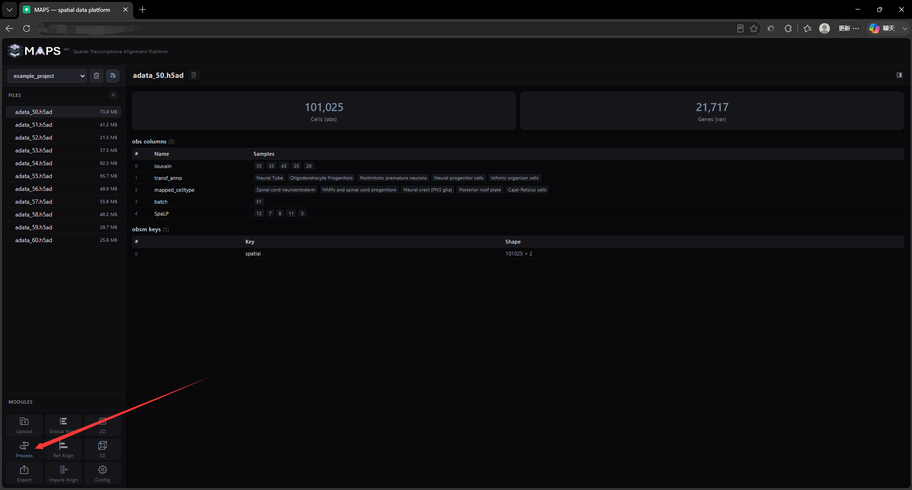
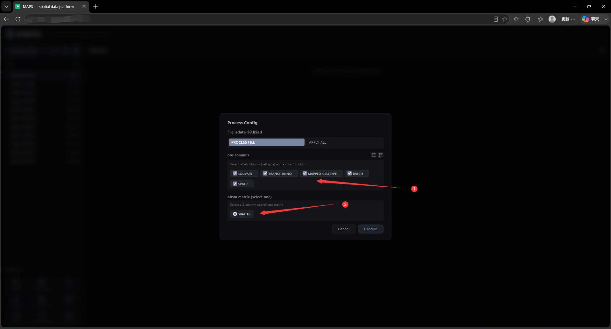
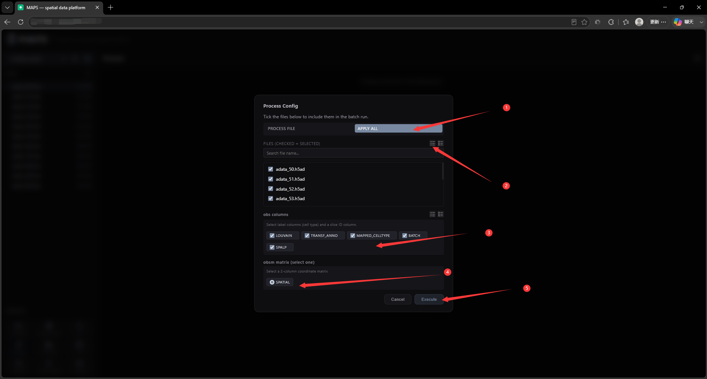
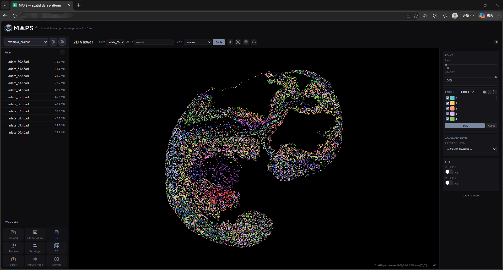

# 2.4 Data Processing

This step accelerates 2D and 3D visualization. Several performance tricks are applied, and your H5AD file is converted to a compact binary format that loads quickly in the browser while keeping memory usage low.

Click any file to view its metadata, then click the **Process** button in the bottom-left corner. In the dialog, choose which `obs` columns to retain, and specify the column that stores the slice coordinates (usually found in `obsm`).

<!-- 这是一张图片，ocr 内容为： -->

<!-- 这是一张图片，ocr 内容为： -->

A batch processing option is also available so you can process every slice at once:

<!-- 这是一张图片，ocr 内容为： -->

Click **Execute** to start processing. The time it takes depends on the size of your slices and the thread setting (configurable on the **Config** page). Once processing finishes, you are taken directly to the 2D visualization view:

<!-- 这是一张图片，ocr 内容为： -->

