# 2.5 2D Visualization

<!-- 这是一张图片，ocr 内容为： -->
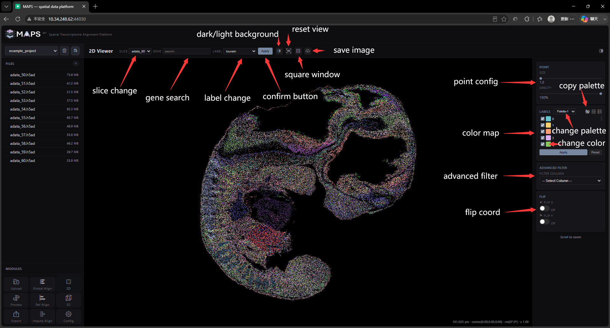

The 2D visualization view packs many features. Here is what the top navigation bar does:

- **SLICE dropdown** — switch between slice files.
  <!-- 这是一张图片，ocr 内容为： -->
  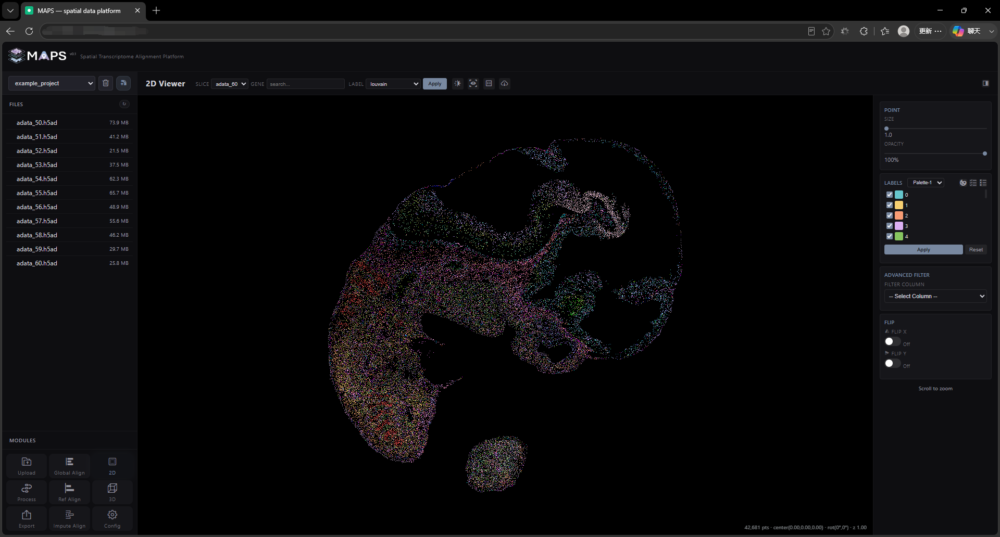
- **GENE input** — search for one or more genes.
  <!-- 这是一张图片，ocr 内容为： -->
  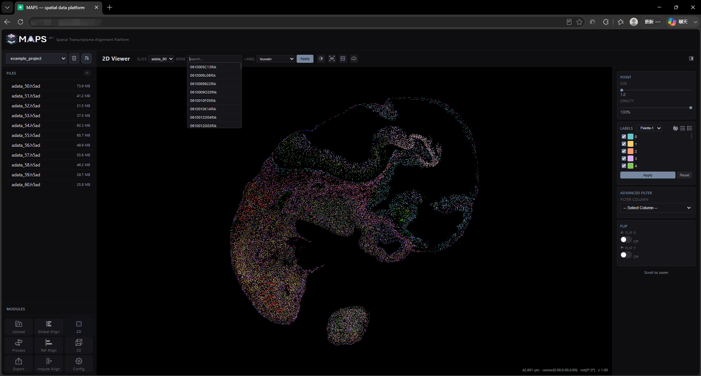
- **LABEL dropdown** — switch between cell-label columns.
  <!-- 这是一张图片，ocr 内容为： -->
  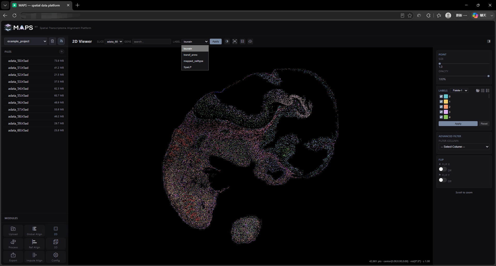
- **Apply button** — click after changing genes or labels to load the new data. Loading time depends on data size.
  <!-- 这是一张图片，ocr 内容为： -->
  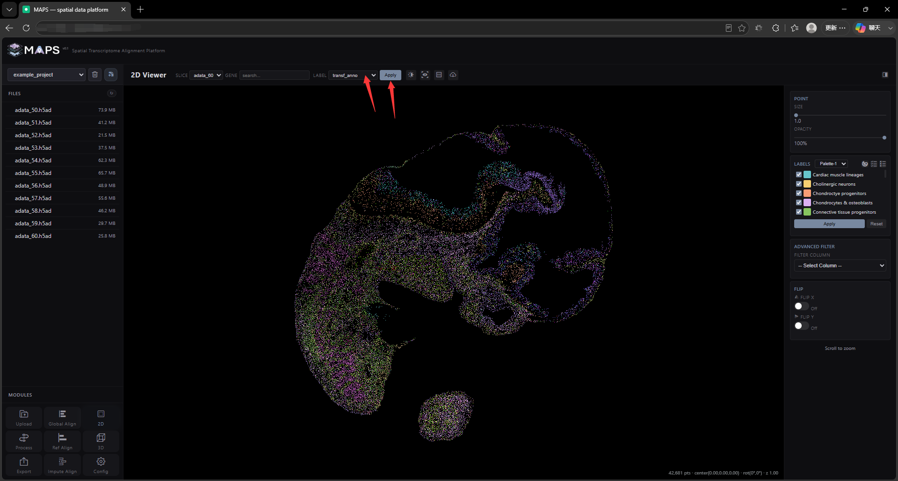
- **Dark / Light button** — toggle the background color. The default is black; this is also configurable on the **Config** page.
  <!-- 这是一张图片，ocr 内容为： -->
  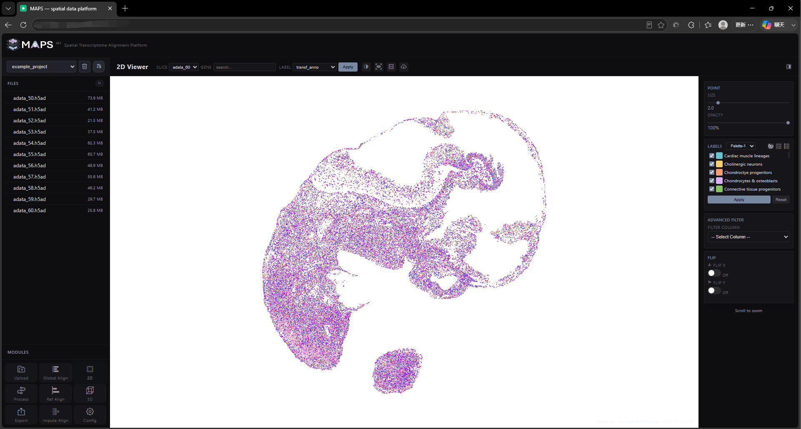
- **Reset button** — restore the default camera. Use right-click drag to pan, the scroll wheel to zoom. The reset button puts the view back to the initial angle and zoom level.
- **Window-shape button** — toggle between a rectangular and a square canvas. The default is rectangular; click again to revert.
  <!-- 这是一张图片，ocr 内容为： -->
  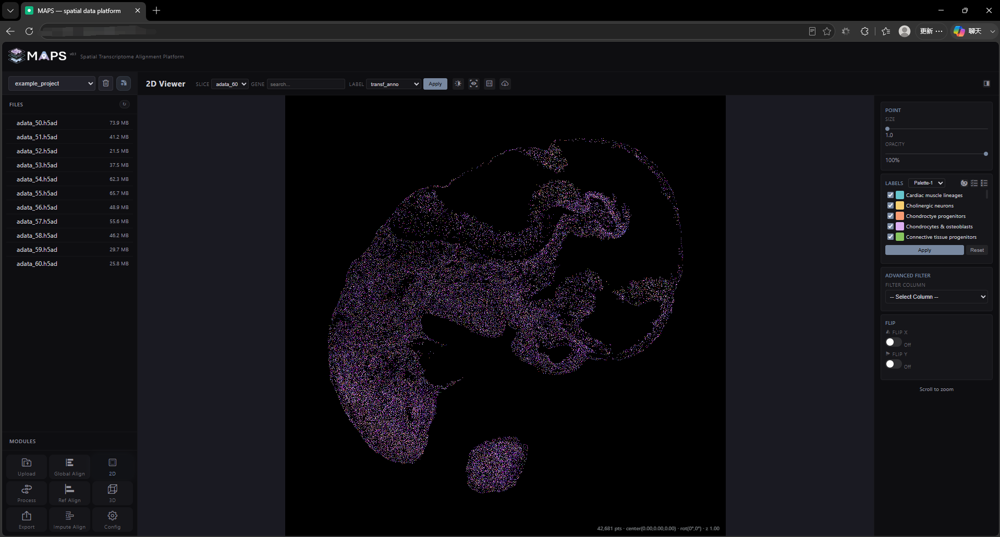
- **Download button** — save the current view as a PNG. Image clarity depends on screen resolution and zoom (the **HD Scale** factor, configurable on the **Config** page, default `2x`).
  <!-- 这是一张图片，ocr 内容为： -->
  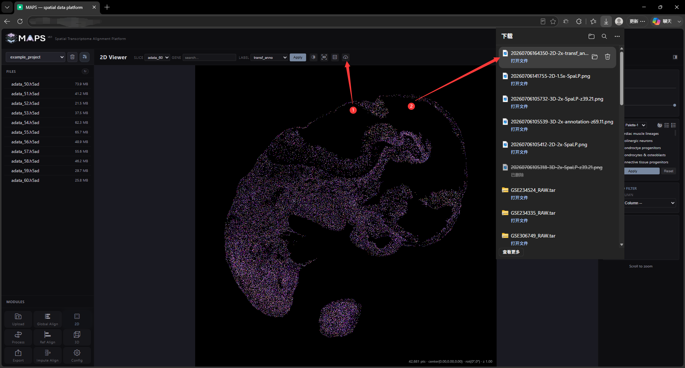

The right-hand sidebar contains the following cards:

- **POINT** — adjust point size and opacity.
  <!-- 这是一张图片，ocr 内容为： -->
  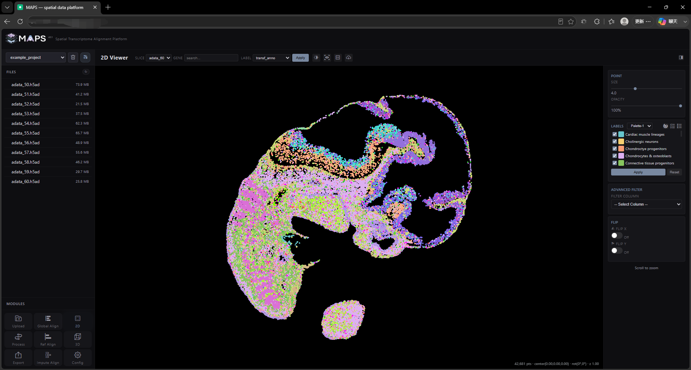
- **LABELS** — manage the color mapping (for categorical labels only; numeric labels such as gene expression ignore it). The dropdown at the right of the title switches the active palette (we ship five palettes, configurable on the **Config** page). The three buttons to the right let you **export the palette**, **select all**, and **clear selection** — shortcuts for the multi-select list below. Use the checkboxes in the list to hide points belonging to specific labels, and click a color swatch to change the mapped color. Click **Apply** after editing colors to refresh the color map; **Reset** restores the default mapping.
  <!-- 这是一张图片，ocr 内容为： -->
  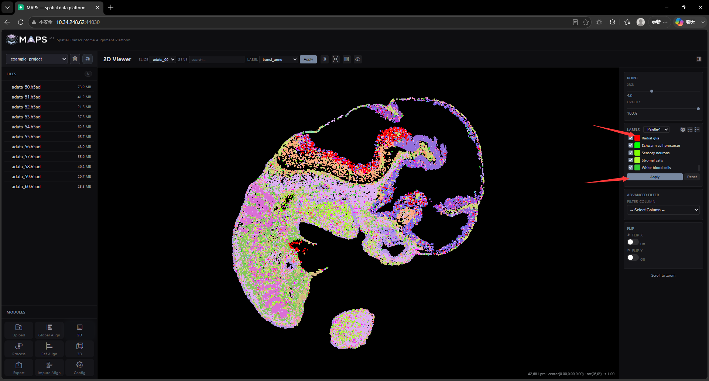
  <!-- 这是一张图片，ocr 内容为： -->
  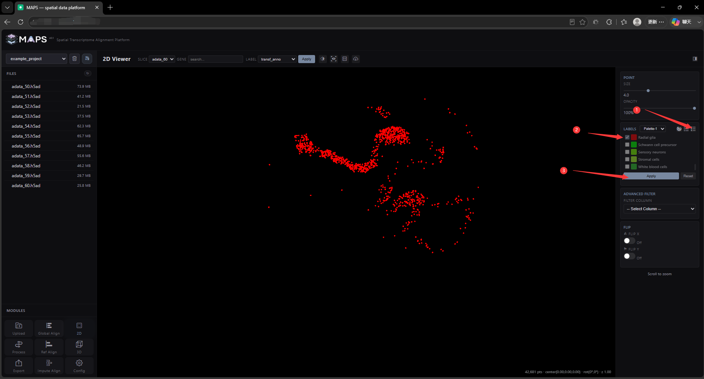
- **ADVANCED FILTER** — filter cells using multiple labels. Pick another label (for example, a higher-level cell type or region) from the dropdown to display only cells that belong to a particular region.
  <!-- 这是一张图片，ocr 内容为： -->
  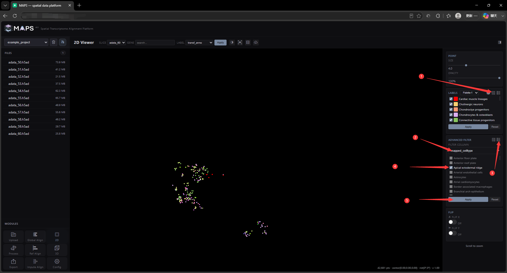
- **FLIP** — mirror the X/Y coordinate axes.
  <!-- 这是一张图片，ocr 内容为： -->
  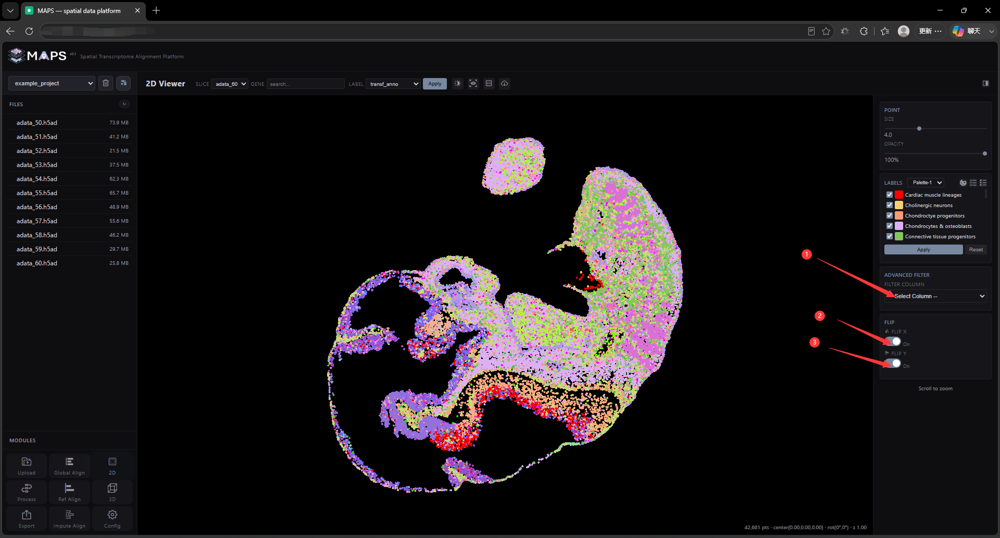
