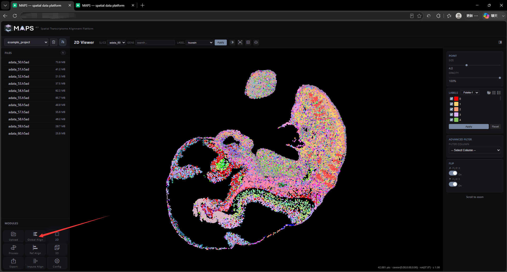
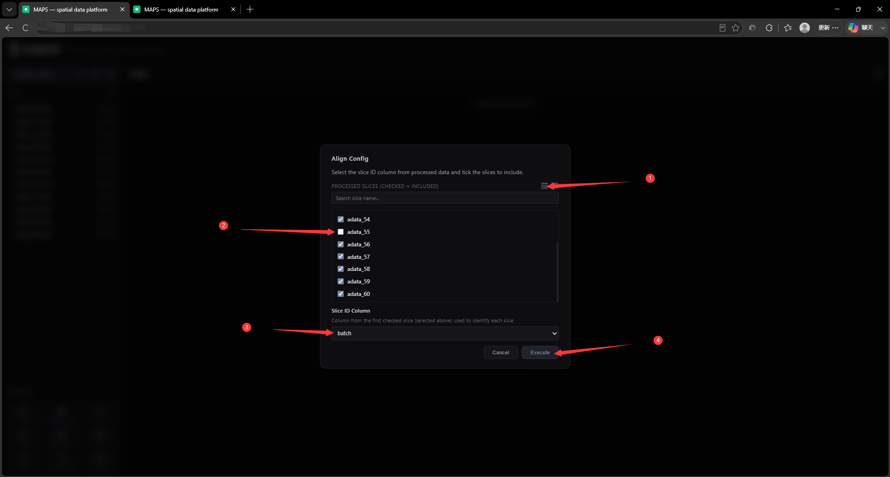
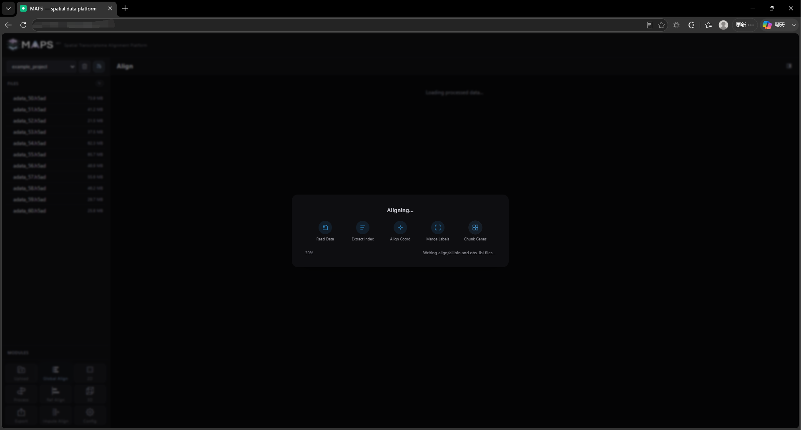
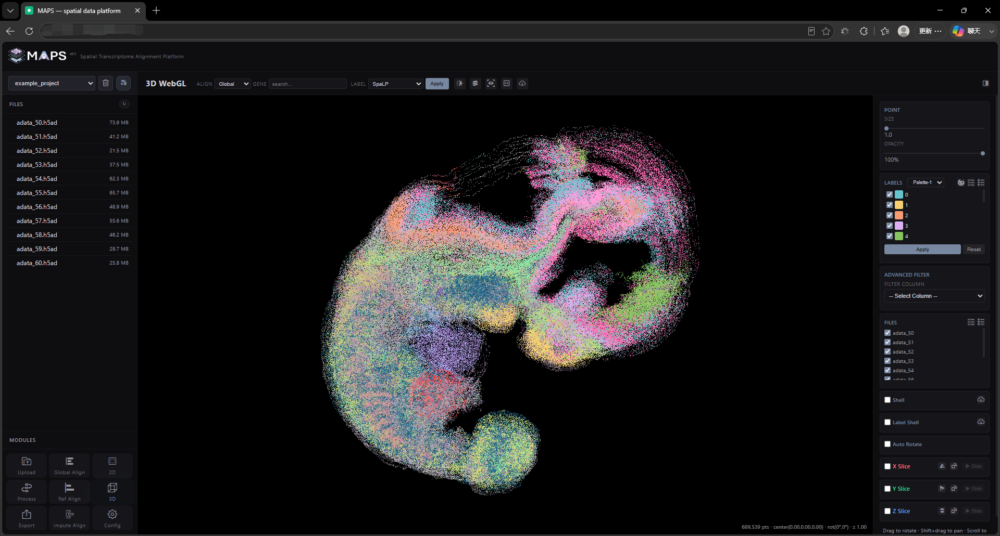

# 2.6 Global Slice Alignment

Click the **Global Align** button in the bottom-left corner to launch a global alignment job. In the dialog, pick the slices to align and the order in which they should appear.

<!-- 这是一张图片，ocr 内容为： -->

For this demonstration, `adata_55` is excluded to illustrate the insertion alignment workflow below. We use a `batch` label as the slice ordering. Be sure to pick the true spatial order; the values in the `batch` column must be numeric.

<!-- 这是一张图片，ocr 内容为： -->

The job may take a while because it integrates the data and computes new coordinates for every slice:

<!-- 这是一张图片，ocr 内容为： -->

When the job completes, the 3D visualization view opens automatically:

<!-- 这是一张图片，ocr 内容为： -->

