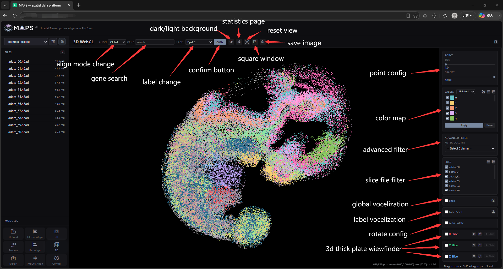
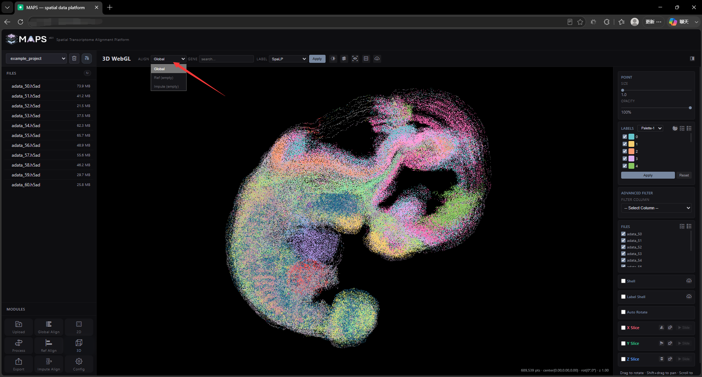
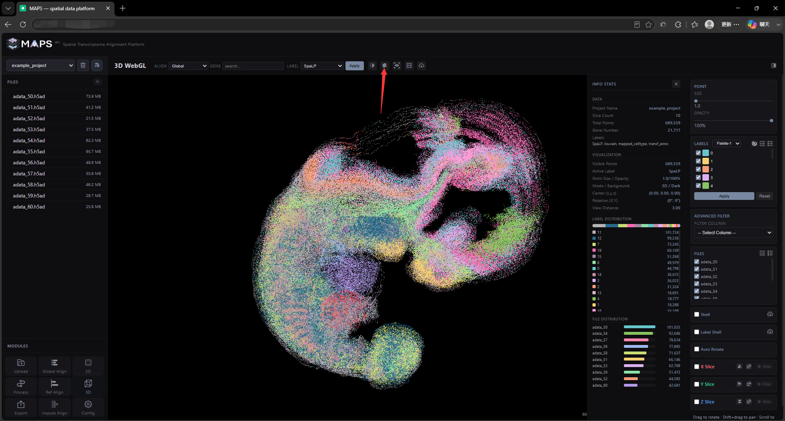
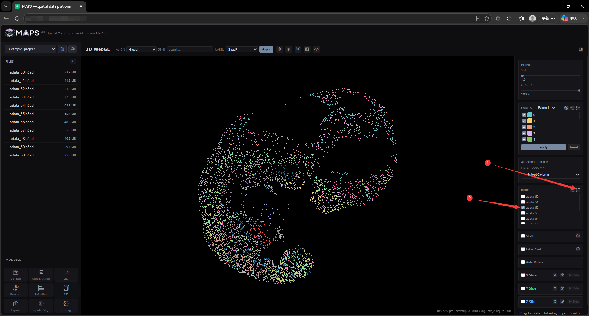
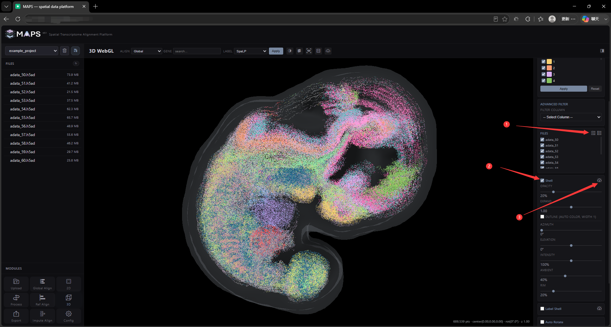
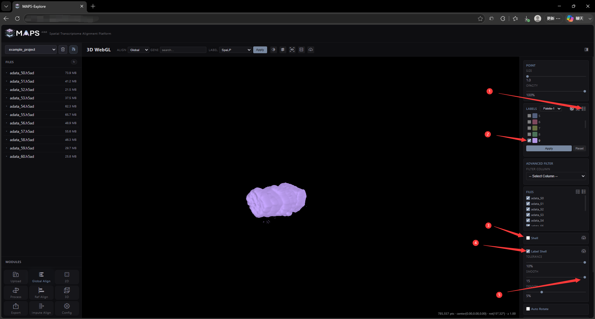
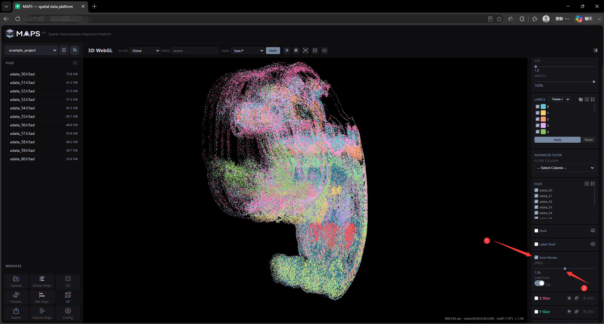
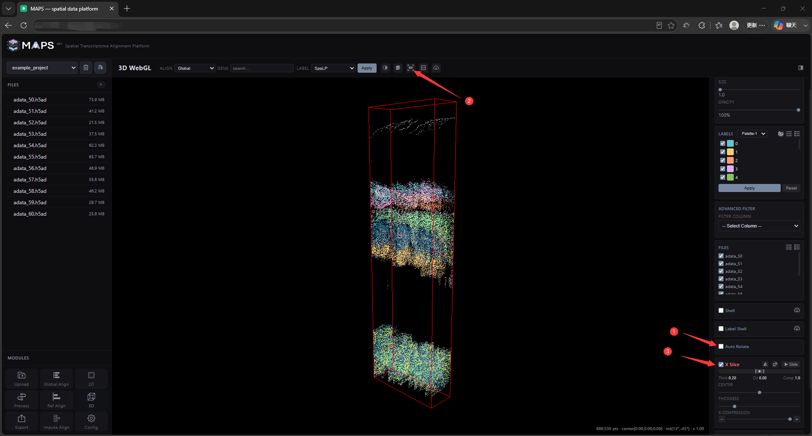
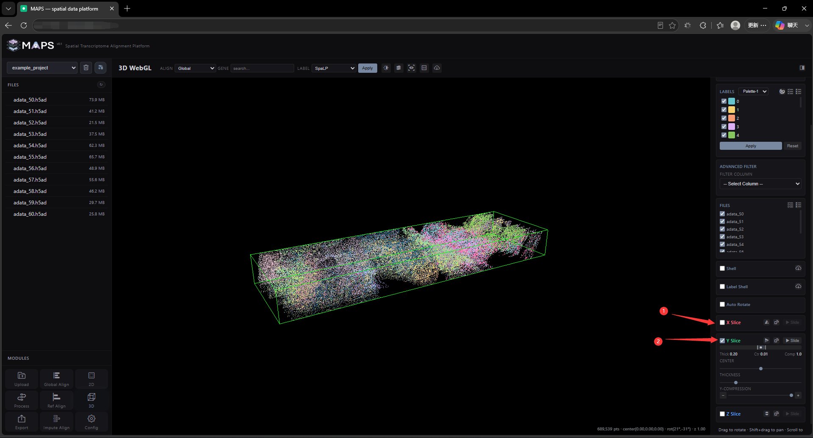
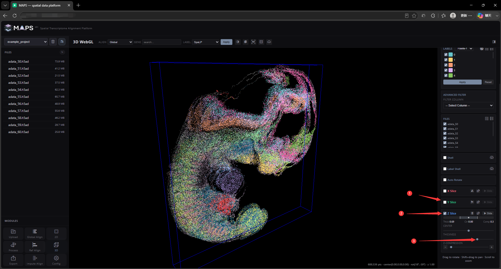

# 2.7 3D Visualization

<!-- 这是一张图片，ocr 内容为： -->

The 3D view offers even more features. Here is what the top navigation bar does:

- **ALIGN dropdown** — switch between alignment modes. If you have not run a particular alignment yet, selecting it falls back to an already-processed mode.
  <!-- 这是一张图片，ocr 内容为： -->
  
- **GENE input** — same as in the 2D view.
- **LABEL dropdown** — same as in the 2D view.
- **Apply button** — same as in the 2D view.
- **Dark / Light button** — same as in the 2D view.
- **Statistics button** — opens an extra sidebar with summary statistics.
  <!-- 这是一张图片，ocr 内容为： -->
  
- **Reset button** — restore the default camera. Use left-click drag to rotate the scene, right-click drag to pan, and the scroll wheel to zoom. The reset button restores the initial angle and zoom.
- **Window-shape button** — same as in the 2D view.
- **Download button** — same as in the 2D view.

The right-hand sidebar contains the following cards:

- **POINT** — same as in the 2D view.
- **LABELS** — same as in the 2D view.
- **ADVANCED FILTER** — same as in the 2D view.
- **FILES** — toggle the visibility of individual slices.
  <!-- 这是一张图片，ocr 内容为： -->
  
- **Shell Panel** — global voxelization. When enabled, MAPS-Explore wraps the entire point cloud in a smooth, semi-transparent closed hull. The hull is computed entirely on the front-end and respects the spacing between slices. Use the controls to adjust hull opacity, expansion distance, outline stroke, and lighting. A **Download Model** button on the right lets you export the mesh for further rendering in your own pipeline.
  <!-- 这是一张图片，ocr 内容为： -->
  
- **Label Shell Panel** — per-label voxelization. When enabled, an opaque, smooth, closed hull is generated around the currently visible point cloud. The hull is computed on the front-end and depends on slice spacing and point density. Use the controls to tune smoothing and the inclusion range. A **Download Model** button is also provided.
  <!-- 这是一张图片，ocr 内容为： -->
  
- **Auto Rotate Panel** — start an automatic rotation; tweak speed and direction as needed.
  <!-- 这是一张图片，ocr 内容为： -->
  
- **X Slice Panel** — X-axis slab viewfinder. A cube clip region appears; only points inside the cube are displayed. Use the **CENTER** slider to move the cube center, the **THICKNESS** slider to change the cube depth, and the **X-COMPRESSION** slider to compress the global X scale. Buttons on the right of the title let you flip the X axis, rotate it 90° clockwise, or auto-play a sliding window along X.
  <!-- 这是一张图片，ocr 内容为： -->
  
- **Y Slice Panel** — Y-axis slab viewfinder. Same controls as the X panel.
  <!-- 这是一张图片，ocr 内容为： -->
  
- **Z Slice Panel** — Z-axis slab viewfinder. Same controls as the X and Y panels. By default, the Z axis is scaled to `0.3` for every project so that slices sit visually closer together; you can change this on the **Config** page.
  <!-- 这是一张图片，ocr 内容为： -->
  
