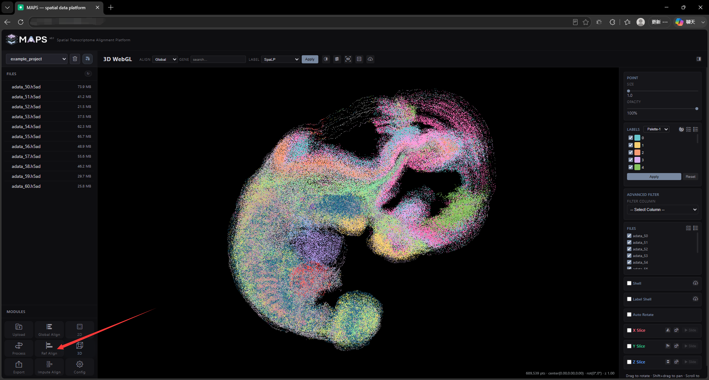
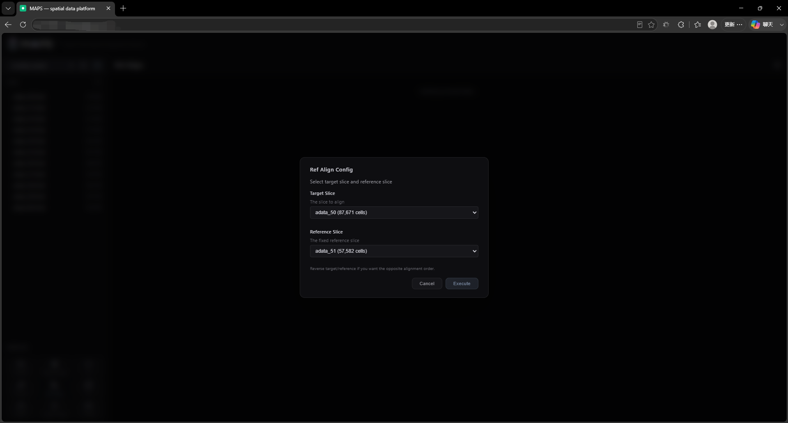
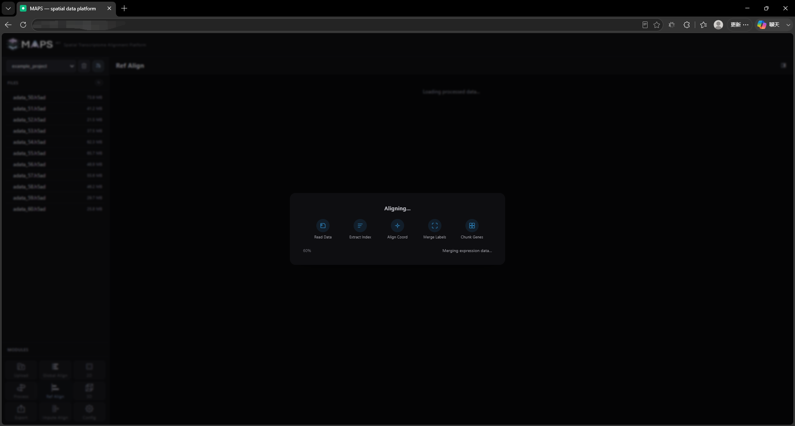
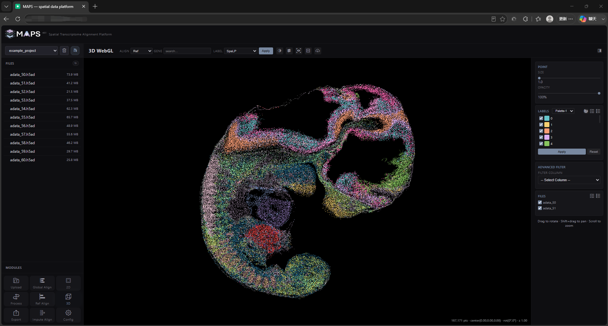

# 2.8 Reference Slice Alignment

This alignment mode has a different goal from global alignment — it brings two chosen slices into register on a common plane. Click the **Ref Align** button in the bottom-left corner to launch the job, then pick the two slices to align.

<!-- 这是一张图片，ocr 内容为： -->

<!-- 这是一张图片，ocr 内容为： -->

Processing will take some time:

<!-- 这是一张图片，ocr 内容为： -->

When processing finishes, MAPS-Explore jumps to a 3D visualization window with a reduced feature set:

<!-- 这是一张图片，ocr 内容为： -->

Specifically, you can only access the two selected slices. Voxelization, rotation, and slab viewfinders are disabled.
