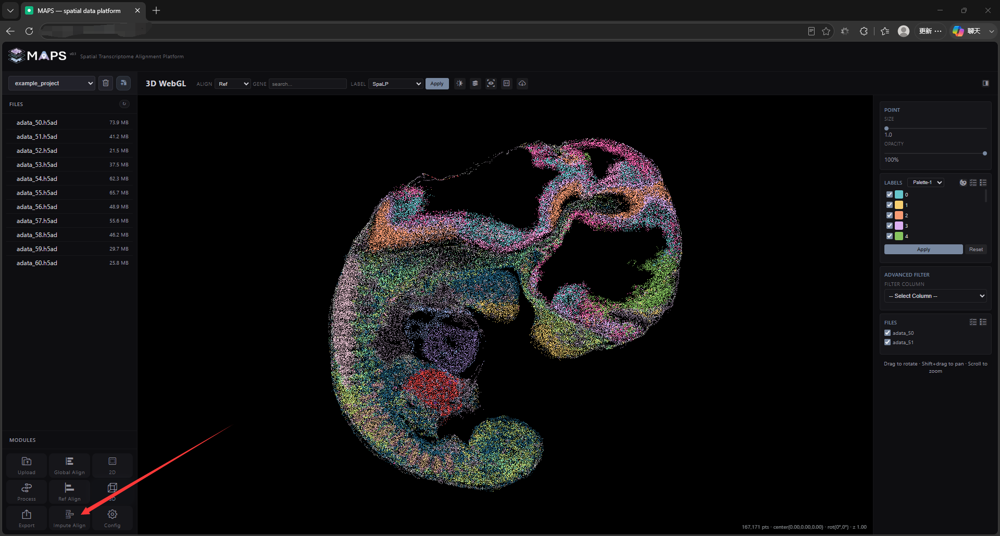
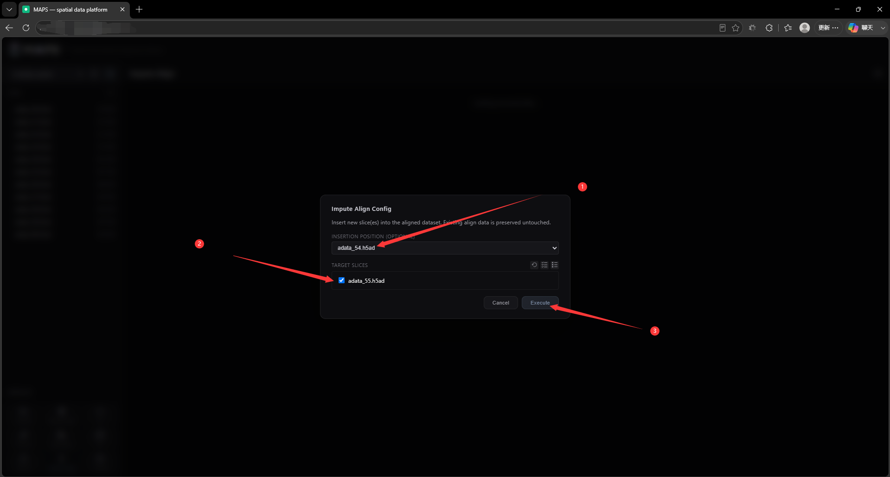
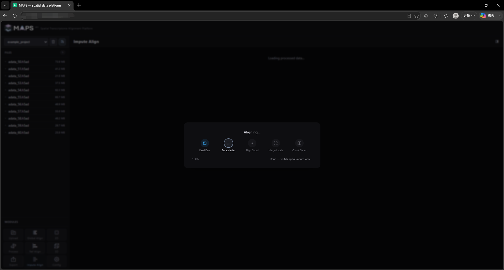
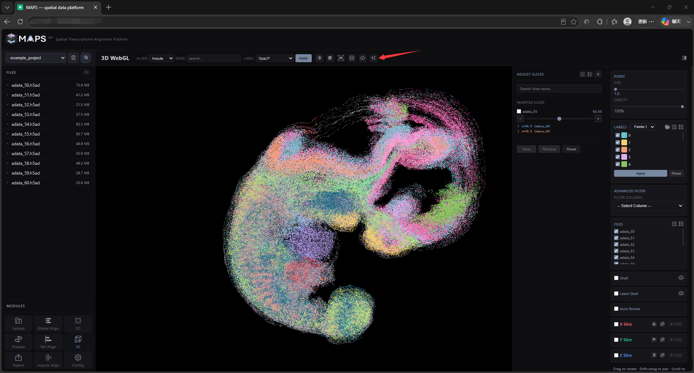

# 2.9 Insertion (Imputation) Slice Alignment

This mode integrates slices that were *not* included in the global alignment into an existing global reference atlas. Click the **Impute Align** button in the bottom-left corner to launch the job, then pick which slices to insert and where they should go.

<!-- 这是一张图片，ocr 内容为： -->

You can choose the insertion position:

- **Auto-match position** — MAPS-Explore automatically matches each slice to its closest neighbour in the existing atlas and inserts it next to it with a Z offset of `+0.5`.
- **UNS_atlas_match-First** — MAPS-Explore reads each slice's `uns` entry and looks up `atlas_match.best_atlas_slice_idx`. You can populate this field in advance to batch-assign insertion targets. The auto-match logic also writes its results back to this field.
- **Manual position (single slice)** — for any individual slice, you can specify the target slice directly. MAPS-Explore inserts the new slice next to it with a Z offset of `+0.5`.

<!-- 这是一张图片，ocr 内容为： -->

Insertion processing time depends on slice size and the thread setting (configurable on the **Config** page).

<!-- 这是一张图片，ocr 内容为： -->

Once insertion completes, the 3D visualization view opens. Click the **Adjust** button at the top to open the list of inserted slices.

<!-- 这是一张图片，ocr 内容为： -->

In that list, you can search slices, adjust their positions, save their positions, and batch-delete inserted slices.
