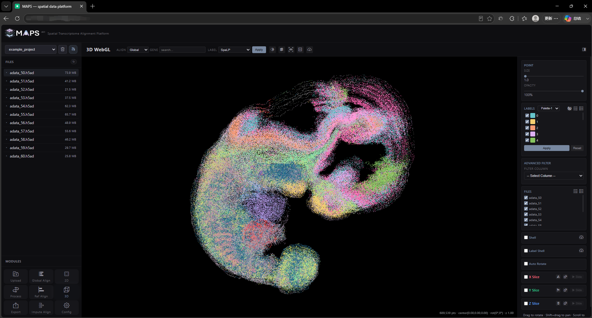
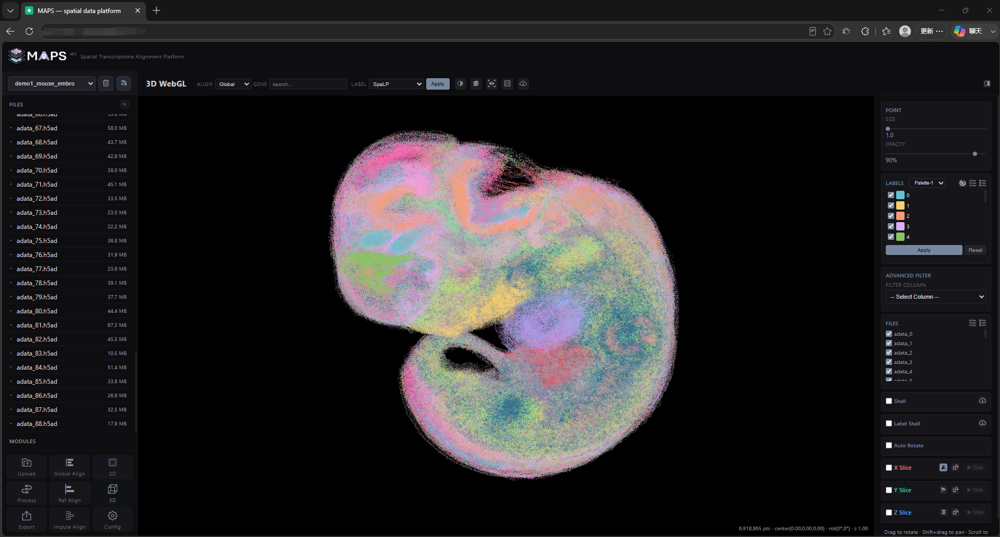
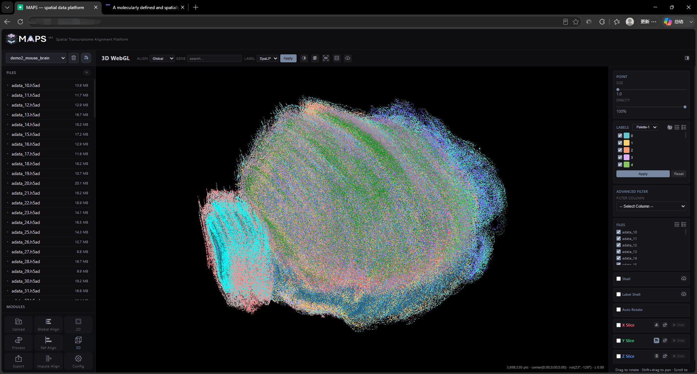
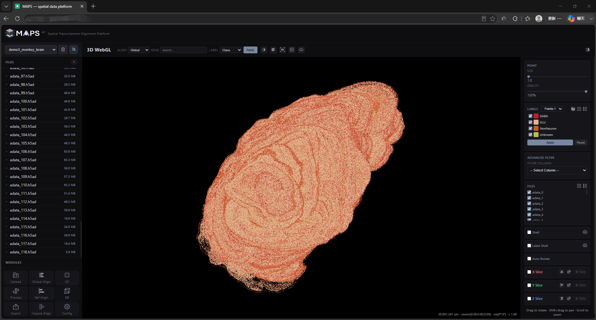
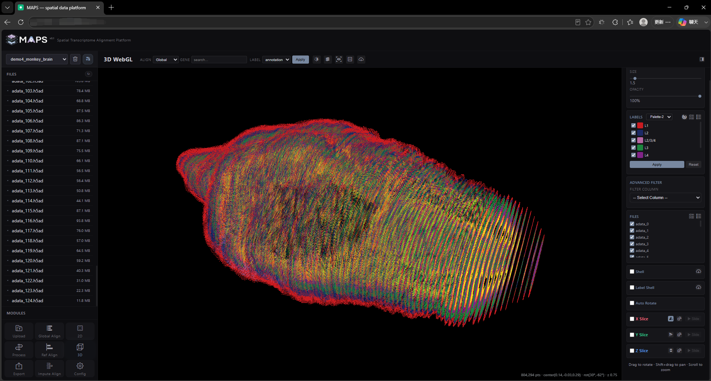
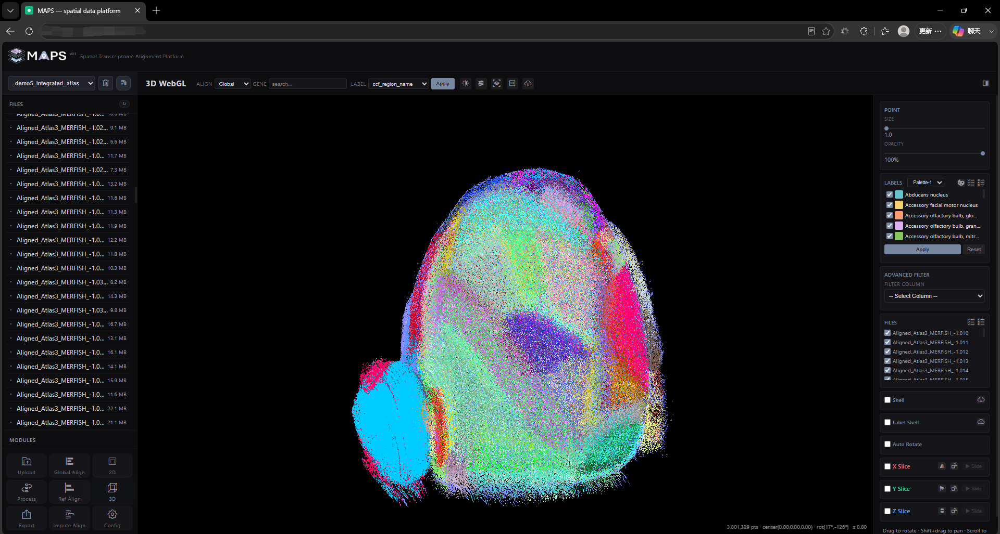
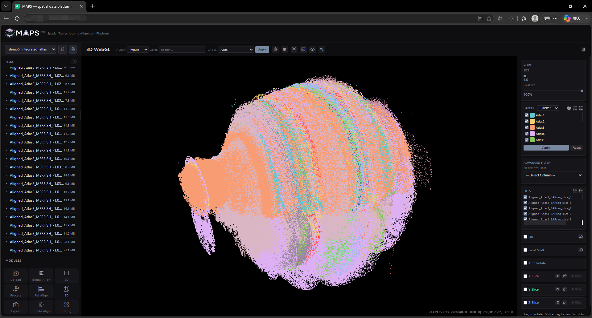

# 3. Demo Data

We have prepared six pre-processed demo datasets. You can browse them at [http://www.bioinfor.tech/maps/](http://www.bioinfor.tech/maps/). For hands-on practice we also provide two reduced test datasets that you can download here: [MAPS-example.zip](https://drive.google.com/file/d/1xrS71mh_tn8CpBYVwZjm2x51R2atUDDF/view?usp=drive_link) and [MAPS-example-full.zip](https://drive.google.com/file/d/1KsbesaQBtDAyKmjK7fNaeLfjwLBbRVWe/view?usp=drive_link).

## 3.1 example_project

A small tutorial dataset: few slices, fast to load. It contains **689,539 cells** in total. The expected global 3D load time is around **5 seconds**.

<!-- 这是一张图片，ocr 内容为： -->

## 3.2 demo1_mouse_embryo

Spatial transcriptomics of a whole **E11.5 mouse embryo** from [Spateo](https://www.cell.com/cell/fulltext/S0092-8674(24)01159-0) (doi: 10.1016/j.cell.2024.10.011). It contains **89 slices** and **6,918,865 cells**. Expected global 3D load time is around **20 seconds**.

<!-- 这是一张图片，ocr 内容为： -->

## 3.3 demo2_mouse_brain

Spatial transcriptomics of a **mouse hemibrain** from the [MERFISH](https://cellxgene.cziscience.com/collections/0cca8620-8dee-45d0-aef5-23f032a5cf09) platform (doi: 10.1038/s41586-023-06808-9). It contains **129 coronal slices** and **3,698,530 cells**. Expected global 3D load time is around **10 seconds**.

<!-- 这是一张图片，ocr 内容为： -->

## 3.4 demo3_mouse_brain

Spatial transcriptomics of the **whole marmoset cerebral cortex** from the [Stereo-seq](https://www.cell.com/cell/fulltext/S0092-8674(23)00679-7) platform (doi: 10.1016/j.cell.2023.06.009). It contains **119 slices** and **30,801,581 cells**. Expected global 3D load time is around **60 seconds**.

<!-- 这是一张图片，ocr 内容为： -->

## 3.5 demo4_monkey_brain

Spatial transcriptomics of the **marmoset cerebral cortex** from the [Stereo-seq](https://www.cell.com/cell/fulltext/S0092-8674(23)00679-7) platform (doi: 10.1016/j.cell.2023.06.009). It contains **125 slices** and **804,294 cells**. Expected global 3D load time is around **3 seconds**.

<!-- 这是一张图片，ocr 内容为： -->

## 3.6 demo5_integrated_atlas

Spatial transcriptomics covering whole or hemibrain samples across **18 sequencing platforms/datasets**. It contains **441 slices** and **21,335,013 cells**. Expected 3D load time is around **10 seconds** for the global alignment (129 slices, reference atlas) and around **50 seconds** for the insertion alignment (441 slices, integrated data).

<!-- 这是一张图片，ocr 内容为： -->

<!-- 这是一张图片，ocr 内容为： -->

